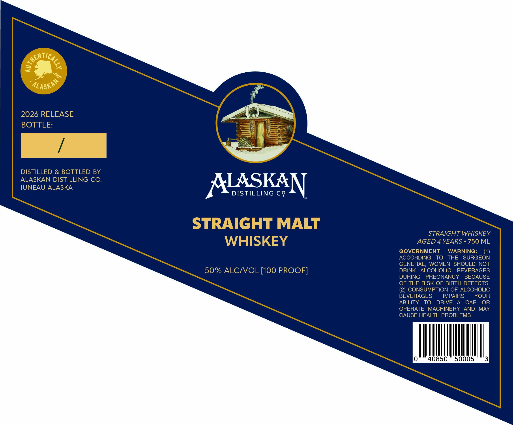

# TTB COLA Label Images - TTBID 26224001000825

**Brand Name:** ALASKAN DISTILLING CO.

**Issue Date:** 08/24/2026

**Origin Code:** 4E

**Product Class/Type:** 117

**Source:** [TTB Public COLA Registry](https://ttbonline.gov/colasonline/viewColaDetails.do?action=publicFormDisplay&ttbid=26224001000825)

## Label Images

### Label 1

## Extracted Label Text

*Text extracted via OCR - may contain errors*

**Detected Proof:** 100
**Detected Age:** 4 Years

### Label 1

@ae
2026 RELEASE
BOTTLE:
DISTILLED & BOTTLED BY
ALASKAN DISTILLING CO.
JUNEAU ALASKA
ALSSKAAN
DISTILLING CQ
STRAIGHT MALT
STRAIGHT WHISKEY
WHISKEY
AGED 4 YEARS
750 ML
GOVERNMENT
WARNING:
ACCORDING
TO
THE
SURGEON
GENERAL,
WOMEN SHOULD
NOT
50% ALCIVOL [100 PROOF]
DRINK
ALCOHOLIC
BEVERAGES
DURING
PREGNANCY
BECAUSE
OF THE RISK OF BIRTH DEFECTS
(2) CONSUMPTION OF ALCOHOLIC
BEVERAGES
IMPAIRS
YOUR
ABILITY
TO
DRIVE
CAR
OR
OPERATE
MACHINERY
AND
MAY
CAUSE HEALTH PROBLEMS.
ALASKAN
