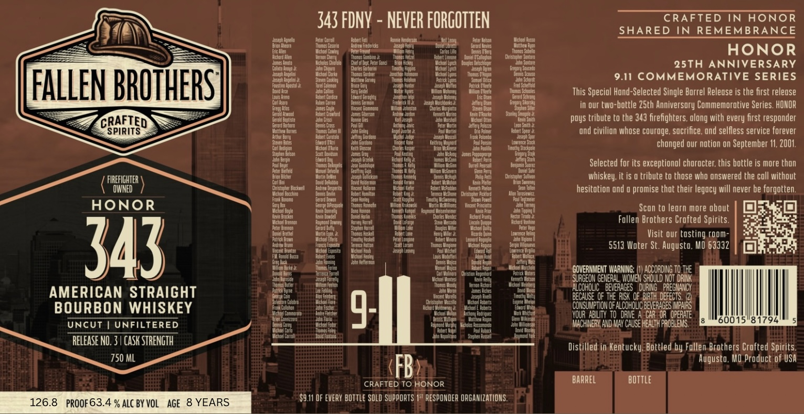
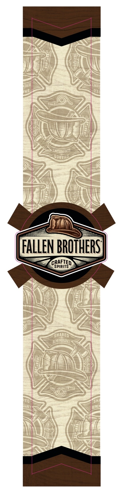

# TTB COLA Label Images - TTBID 26225001000023

**Brand Name:** FALLEN BROTHERS CRAFTED SPIRITS

**Fanciful Name:** HONOR 343 AMERICAN STRAIGHT BOURBON WHISKEY

**Issue Date:** 09/03/2026

**Origin Code:** 29

**Product Class/Type:** 101

**Source:** [TTB Public COLA Registry](https://ttbonline.gov/colasonline/viewColaDetails.do?action=publicFormDisplay&ttbid=26225001000023)

## Label Images

### Label 1

### Label 2

## Extracted Label Text

*Text extracted via OCR - may contain errors*

### Label 1

CRAFTED IN HONOR

343 FDNY - NEVER FORGOTTEN

SHARED IN REMEMBRANCE

afey

dese pe

Pew

ew wi

Noses

EX

(ieee

ores

‘oo oi

anette

Kove: "mpi

ae

rs

ents

ena Fey

HONOR

a

—--

est ee

Mame eben

ie

a eoge

De fit Pi a n,

Kelly

asap by

25TH ANNIVERSARY

‘veg

hoe

ace are

Ppl

"haa ta

4

‘ame Bt

dea et

9.11 COMMEMORATIVE SERIES

ender

ie

ita

‘anlbiens

cy

feist

‘ap ee

fe pes

Wier bee,

Misa Tae

ford Te

FALLEN BROTHERS

Colese

ous ee

Nata

Iettotce

Seabee

fer

onions

ican

This Special Hand-Selected Single Barrel Release is the first release

aces

ef a

in our two-bottle 25th Anniversary Commemorative Series. HONOR

er tte

aati

‘ete tt

‘me eae

Idi sit

ta oan

Teme

‘aaa

Ain Paste

or

‘ee at

poys tribute to the 343 firefighters. along with every first responder

CRAFTED \ =

SPIRITS

Scot betes

Atos ae,

nas Cs

‘an fe

fata

Sate

Aap te

esate

False

Aiea gen

ustach

tea

Stes

duet Pe

sda

‘eg Scie

ace te

“ken

Yala

ore St

‘and civilian whose courage, sacrifice. and selfless service forever

Nod Fane

tech Gece

Date tp

“volt

obeie

changed our nation on September 11, 2001.

Bebe

‘et an

son ih

Aha

ale

hae eto

ree

at

ea ey

(ica ves

tend eal

oe

eal

Selected for its exceptional character, this bottle is more than

Cotta

ion bee

‘hea

vd eat

teed ater

Slate

‘ea Lew

sete es:

paring

rahe

rit

whiskey, it is a tribute to those who answered the call without

( FIREFIGHTER )

eb ter

sit et

‘Peer

"nit

hesitation and o promise that their legacy will never be forgotten.

frat aa

‘sate

etter

fiber teat

feat

‘otto

Tce oe

a ism

HONOR

ery Drage

Sens hns

‘ee tacts

‘Bea

Aen ag

gander

‘ata ins

Voce eats

‘ait

Scan to learn more about

40

oe ens

Seti

on

‘es

‘neers

fot at

Sec et.

Follen Brothers Crafted Spirits.

er bean

Pry

Agr ey

gia

ie ae

me

Pere

Fare eo

Sead ett

pod

a pe

Ay ie

(amt ae

EE

Sigel

Visit our tasting coom-

fem

ec tan

ee

et

(ae eg

5513 Water St. Augusta. M0 63332

A

Wedd eg

Sateen

alas

‘eet

ty

cy

ik

esse

fealiee

*coverent Laer 1) ACCORDING TO THE

543

a

ete

Celine

Chuan

ee GENE

Tom

te

ae

(ela

ae “as A ee

AMERICAN STRAIGHT

ie

Watiot

iene,

tr ae

BOURBON WHISKEY

sane

SHSUIETONG fF Aah ous hats

dautis

ier cae

Niet

8

'60015'8

I

794

UNCUT | UNFILTERED

Toney

q.

eB

ae

(MACHINERY, AND MAY CAUSE HEALTH PROBLEMS.

Wes

‘eens

sha

RELEASE NO. 3 | CASK STRENGTH

Distilled in Kentucky, Bottled.by Fallen.Brothers Crafted Spirits.

750 ML

Augusta, MO Product of USA

CRAFTED TO HONOR

9.1 OF EVERY BOTTLE SOLD SUPPORTS/1% RESPONDER ORGANIZATIONS

Pf fp

### Label 2

NINJU
Hhs
0]
DNYUAMBMTU
Qauv5
FALLEN BROTHERST
CRAFTED
SPIRITS
SHARED
~REMEMBRANGE
TED
KANCE
REME
IJMYU
