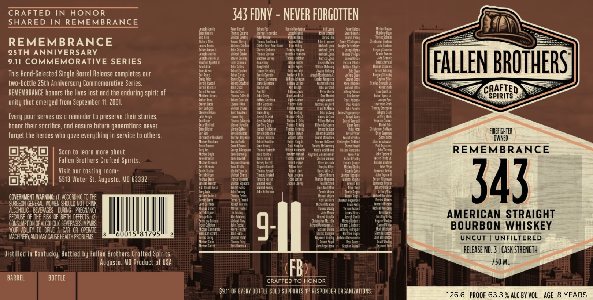

# TTB COLA Label Images - TTBID 26225001000024

**Brand Name:** FALLEN BROTHERS CRAFTED SPIRITS

**Fanciful Name:** REMEMBRANCE 343 
AMERICAN STRAIGHT BOURBON WHISKEY

**Issue Date:** 09/03/2026

**Origin Code:** 29

**Product Class/Type:** 101

**Source:** [TTB Public COLA Registry](https://ttbonline.gov/colasonline/viewColaDetails.do?action=publicFormDisplay&ttbid=26225001000024)

## Label Images

### Label 1

### Label 2

## Extracted Label Text

*Text extracted via OCR - may contain errors*

**Detected Proof:** 126.6
**Detected Age:** 8 Years

### Label 1

CRAFTED
IN HONOR
343 FDNV
NEVER FORGOTTEN
SHARED
IN REMEMBRANCE
Josesh Ugpello
Pece; Eartoll
Oadejt Fxti
Eintie Kenterst ]
Iullam
Feter Helsot
Vichdl Fissd
luson ]
Urdrzw Fredericks
uile] [Ibrzbi
Gerdid €
Voltieu Eror
Vic Ullen
Mctue  Ccxley
Petet Frel
Col; |iu
Wantm
REMEMBRANCE
ochord Let
Londico X
@amiel DCc
rstopber !
Jones Mum
Chogfal
Defti @ert Verer Gcid
Uoiges
25TH ANNIVERSARY
Foteth Iognik
Vichodl
Hue
Fuenes Gored|
6ronrsseouge
Ihonts
VJoseah Uncelie
Sicueh Lodldy
Vanhey buvey
lgtns
Uilce
Acinmi
9.11 COMMEMORATIVE SERIES
Hhei
Locsbal
Ficon
Unc? =
Dhsepi Multto
veeie
Fred Schefmld
FALLEN BROTHERST
Aduld Urte
Mueele
Idpeos E bpokes
Lougs Weed
Linticz
[ductd Gerogtty
Dic Uise
Eertcd Schring
This Hond-Selected Single Borrel Releose completes our
coniason
Ilwted
Venn 5 Fenmtin
Vordbants
eller Uised
Grec_ro Sunisty
Kcent Grinoning
Mbk;
Slephed Sul
two-bottle ZSth Anniversory Commemorative Series.
Eoulord
Tmoriemn
Muibe
Sloeley Sonjulac
cergld copciste
CRAFTED
REMEMBRANCE honors the lives lost ond the enduring spirit of
Mcttted Bortes
uen m
Jann Chuley
ll
Eexl Swint K
SPIRITS
Schlumhmtti
meerhmtmt
Jerlrey Eondord
Frunt Deonob
unity thot emerged from September I4. 2001.
teven eutes
Glecdznd
Lowca Sock
ceen
Thleena
Tinothu Shac tpale
Atepten telsot
Plji
pour serves OS @ reminder to preserve their stories,
Jeeph Grelot
swatlei
Lhel !
Eeye
[aeiqulis
hurvel Feorsol
Fer unin UTEL
honor their socrifice, ond ensure future generotions never
Feter Duckteld
Geofirey uje
Dzlel Sahf
Eacter
ictsda
Erstopter Suliion
FIREFIGHTER
forget the heroes who gave everything in service to others.
cordiri
Doul] Ho Jemcn
Wmp
Ietlu pleiler
Sucerey
Ehnsloper Dkcine]
Uexnech Chelot
Ioton
OWNED
Ieoce ina
Ardet Kemltt
Chisroahet Actiatt
Uon Torosletcz
eon buney
Hud Icaineer
Scan to leorn more obout
Michteleore
"nod
dgnind Vesenbebie
Vncen Rinthiba
REMEMBRANCE
Hen Unacoe]
Umid
Mue
Charkes Wencer
Dichbrd Erinte
cpfmechimm
Follen Brothers Crofted Spirits.
Uchzeleregnin
Horvey Hurtell
Sete Mercocd
Hnelm
Achart
Wamtte
ceter Keqd
Visit our tosting room-
rehel
Hskell
Vicub
Lintence L
rubich Urchn
cadel Euferts
Lecodd
~oht Ugieno [
5513 Woter St. Augusto, MO 63332
Hexos Esosh
Vichocl
Exh leseer
Lembiz Hrre
343
Hmine
Dcto
Vic oel Heale]
Feme uoeue
Hefirnot
Feflery
GOVERNMEHT WARMING;
ACCORDING TO THE
Eenceaeti
Solniom
ClcIstLn
SURGEON GENERAL' WOMEN SHould Not DRIK
Wntesi
alcoholc _ beveRAGES ' duRNG   PREGMANCY
Tenat Pct
BECauSE of The RISK oF BITH defects /21
Mneereemein
Unelf
AMERICAN STRAIGHT
CONSUMPTION OF ALCohoLIC BEvERAGES IMPAIRS
Jonmdi
Elaar
Christoohel
Hacune
Dulelts
VOUR ABILITY^ toDNE A CAR OR  OPERATE
Enlbne arti
9
Achire
Actens
BOURBON
WHISKEY
MACHINERY AND MAY CauSE HEalth PROBLEMS
60015"81795
Cantitiur
UnCUT
UNFILTERED
Distilled in Kentucky: Bottled by Follen Brothers Crafted Spirits
Release NO. 3 | CASK STRENGTH
Augusto, MO Product of USA
750 ML
barrel
bottle
FB
CRAFTED TO HONOR
S9.11 OF EVERY bottle SOLD SuppORTS 1st RESPONDER ORGANIZATIONS.
126.6
PROOF 63.3 % ALC BY VOL
AGE
8 YEARS
Citoui
otts
Wabent]
Dotu
Every
LSn
brenten
Uku
Hdti

### Label 2

NINJU
Hhs
0]
DNYUAMBMTU
Qauv5
FALLEN BROTHERST
CRAFTED
SPIRITS
SHARED
~REMEMBRANGE
TED
KANCE
REME
IJMYU
