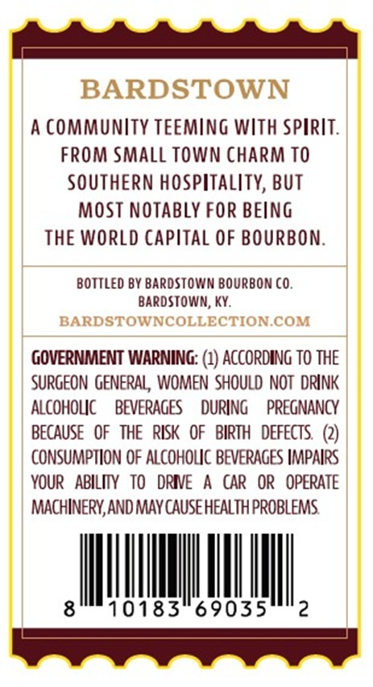
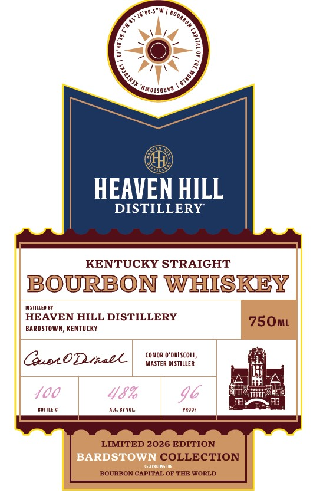

# TTB COLA Label Images - TTBID 26225001000099

**Brand Name:** HEAVEN HILL DISTILLERY

**Issue Date:** 08/31/2026

**Origin Code:** 22

**Product Class/Type:** 101

**Source:** [TTB Public COLA Registry](https://ttbonline.gov/colasonline/viewColaDetails.do?action=publicFormDisplay&ttbid=26225001000099)

## Label Images

### Back Label

### Label 1

### Label 2

## Extracted Label Text

*Text extracted via OCR - may contain errors*

### Back Label

BARDSTOWN
community TeEmiNG With spirit:
FROM SMAll Town charm TO
SOUTHERN hospitality, BUT
MOST NOTABLy FOR BEiNG
THE World Capital OF BOURbon
BOTTLEO BY BAROSTOWN BOURBOn co_
Bardstowm; Ky:
BARDSTOWNCOLLECTION COM
GOVERNMENT WARNING: (1) AccordING TO THE
Surgeon GENERAL , WOMeN Should NOT DRINK
ALCOHOLC
BEVERAGES
durInG
PREGNANCY
BecauSE   OF  THE   RISK   OF   BIRTH   defECTS   (2)
CONSUMPTION OF Alcoholc BEVERAGES HMpalrs
YOUR   abilIy   tO   DRIVE
CAR   OR   OPERATE
MachIneRY,AND May cause healTh pROBLeMS
8
10183"69035
2

### Label 1

Rosw >,

8).

7W\

ee,

HEAVEN HILL

DISTILLERY

KENTUCKY STRAIGHT

BOURBON WHISKEY

sismuco ar

HEAVEN HILL DISTILLERY

750m

BARDSTOWN, KENTUCKY

QuwtOD tiatl

(MASTER DISTILLER

CONOR O'DRISCOLL,

tome’

auc Avvo,

Root

LIMITED 2026 EDITION

COLLECTION

BOURBON CAPITAL OF THE WORLD

### Label 2

%.
7,
LIMITED 2026 EDITION
4
LIMITED 2026 EDITION
40
37"48'29.5"N
Kentucky
:
2
1
1
1
Ild N)
JHL
