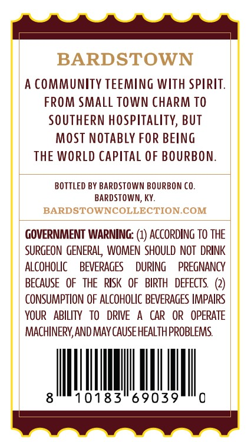
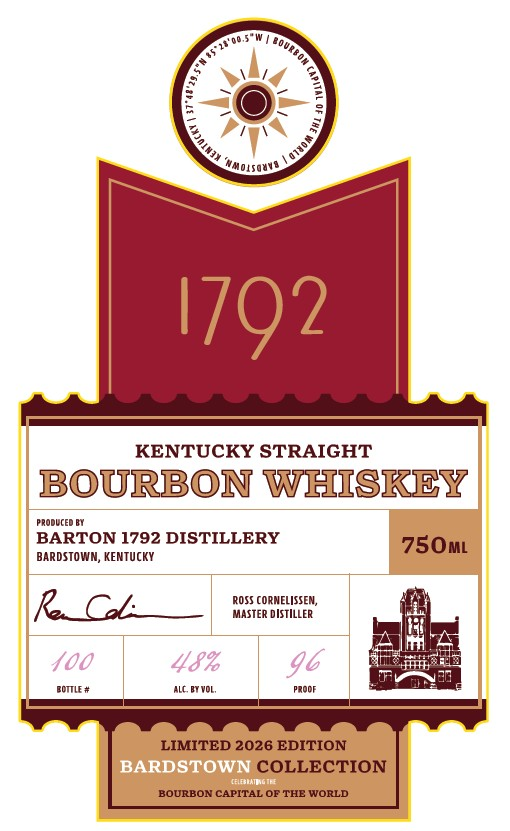

# TTB COLA Label Images - TTBID 26225001000102

**Brand Name:** 1792

**Issue Date:** 08/21/2026

**Origin Code:** 22

**Product Class/Type:** 101

**Source:** [TTB Public COLA Registry](https://ttbonline.gov/colasonline/viewColaDetails.do?action=publicFormDisplay&ttbid=26225001000102)

## Label Images

### Back Label

### Label 1

### Label 3

## Extracted Label Text

*Text extracted via OCR - may contain errors*

**Detected Proof:** 96

### Back Label

BARDSTOWN
A COMMUNITY TEEMING WIth Spirit.
FROM SMall TOWN CHARM TO
SOUTHERN hospitality, BUT
MOST NOTABly FOR BEING
THE WORLD Capital OF BOURBON:
BOTTLEd BY BARDSTOWN BOURBON CO.
BARDSTOWN; KY
BARDSTOWNCOLLECTION COM
GOVERNMENT WARNING: (1) ACCORDING To THE
SURGEON  GENERAL   WOMEN  SHOULD NOT   DRINK
ALCOHOLIC
BEVERAGES
DURING
PREGNANCY
BECAUSE   OF   THE   RISK   OF   BIRTH   DEFECTS
CONSUMPTION OF ALCOHOLIC BEVERAGES IMPAirs
YOUR
ABILITY
TO
DRIVE
CAR
OR
OPERATE
MACHINERV, AND MAY CAUSE HEALThPROBLEMS
10183
69039

### Label 1

MoLsQUvA
1792
KENTUCKY STRAIGHT
BOURBON WHISKEY
Produced Bi
BARTON 1792 DISTILLERY
750ML
BARDSTOWM, KENTUCKY
RCl:
ROSTer VSTIEEER ,
400
48%
96
Fomt =
Alc BT VOL,
Prooe
LIMITED 2026 EDITION
BARDSTOWN COLLECTION
Wnsiaicnl
BOURBON CAPITAL OF THE WORLD
Jurbon
1
Qwuo

### Label 3

%.
7,
LIMITED 2026 EDITION
4
LIMITED 2026 EDITION
40
37"48'29.5"N
Kentucky
:
2
1
1
1
Ild N)
JHL
