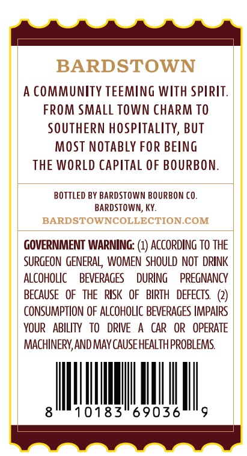
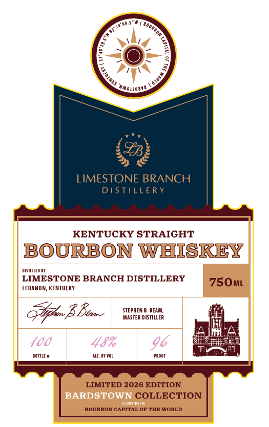

# TTB COLA Label Images - TTBID 26225001000105

**Brand Name:** LIMESTONE BRANCH DISTILLERY

**Issue Date:** 08/31/2026

**Origin Code:** 22

**Product Class/Type:** 101

**Source:** [TTB Public COLA Registry](https://ttbonline.gov/colasonline/viewColaDetails.do?action=publicFormDisplay&ttbid=26225001000105)

## Label Images

### Back Label

### Label 1

### Label 3

## Extracted Label Text

*Text extracted via OCR - may contain errors*

**Detected Proof:** 96

### Back Label

BARDSTOWN
A CommunITY TEEMING With SPirit:
FROM Small TOWN CHARm TO
SOUTHERN hospitality, BUT
MOST NOTABLy FOR BEING
THE WORLD Capital OF BOURBON:
BOTTLED BY BARDSTOWN BOURBON CO.
BArdstown; Ky:
BARDSTOWNCOLLECTION.COM
GOVERNMENT WARNING: (1) ACCORDING to THE
SURGEON  GENERAL  WOMEN ShOULD NOT  DRINK
ALCOHOLIC
BEVERAGES
DURING
PREGNANCY
BECAUSE   OF   THE   RISK   OF
BIRTH   DEFECTS
CONSUMPTION OF ALCOHOLIC BEVERAGES IMPAIRS
YOUR   ABILITY
TO
DRIVE
CAR
OR   OPERATE
MACHINERV, AND MAV CAUSE HEALTHPROBLEMS
10183
69036

### Label 1

4
'MMoLsQMvA
LIMESTONE BRANCH
DISTILLE RY
KENTUCKY STRAIGHT
BOURBON WHISKEY
DSTIFDBY
LIMESTONE BRANCH DISTILLERY
750ML
LEBANOM; KENTUCKY
B Ban
STEPHEM
BEAM
MASTER DIsTILLeR
400
48%
96
Z0Mr #
MCBVoL
procr
LIMITED 2026 EDITION
BARDSTOWN COLLECTION
[induaeng IL
BOURBON CAPITAL OF THE WORLD
JouRbon (
1
0
LQuuod

### Label 3

%.
7,
LIMITED 2026 EDITION
4
LIMITED 2026 EDITION
40
37"48'29.5"N
Kentucky
:
2
1
1
1
Ild N)
JHL
