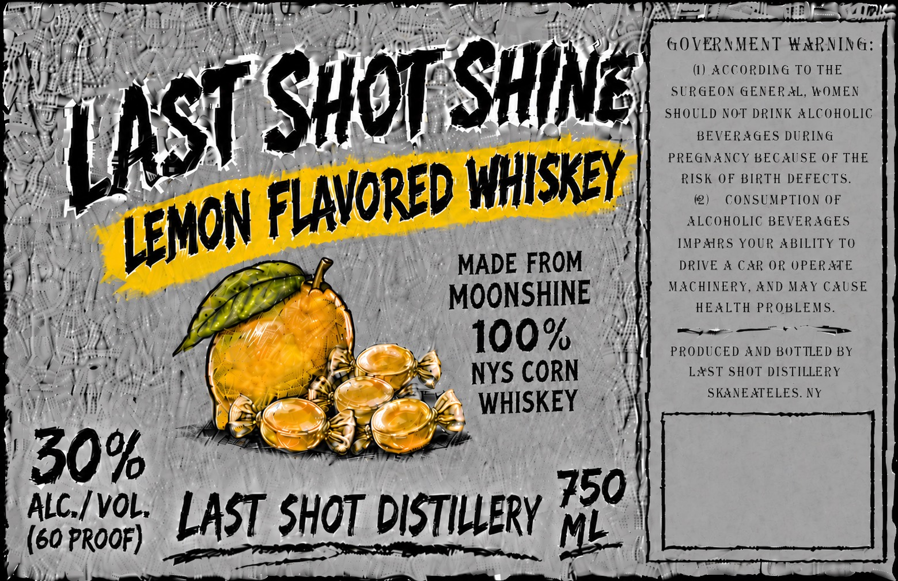

# TTB COLA Label Images - TTBID 26225001000211

**Brand Name:** LAST SHOT SHINE

**Issue Date:** 09/01/2026

**Origin Code:** 02

**Product Class/Type:** 149

**Source:** [TTB Public COLA Registry](https://ttbonline.gov/colasonline/viewColaDetails.do?action=publicFormDisplay&ttbid=26225001000211)

## Label Images

### Label 1

## Extracted Label Text

*Text extracted via OCR - may contain errors*

**Detected Proof:** 60

### Label 1

HuS
6OVERAMENT WARNING:
(1) ACCORDIN 6 To THE
SHING
SURGEON GENERALS_
WOMEN
SHOULD NOT DRINK ALCOHOLIC
BEVERAGES DURING
PREGNAVCY BECAUSE OF THE
WHISKLY
RISK OF BIRTH DEFECTS_
(2)
CONSUMPTION OF
ALCOHOLIC BEVERAGES
IMPARS YOUR ABILITY To
MADE FROM
DRIVE 4 CAR OR OPERATE
MACHINERY, AND MAY CAUSE
MOONSHINE
HEALTH
PROBLEMS_
100%
PRODUCED AND BOTTLED BY
NYS CORN
LxST SHOT DISTILLERY
SKAVEATELES NY
WHISKEY
30%
ALC / voL;
LASi SHOi DISTIWERv 750
(60 ProoF)
LAST Shot
FLAVORed
LEMON
