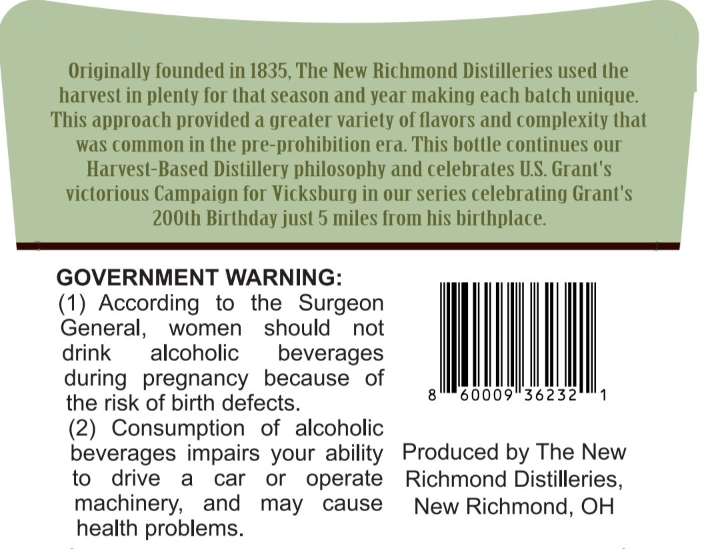
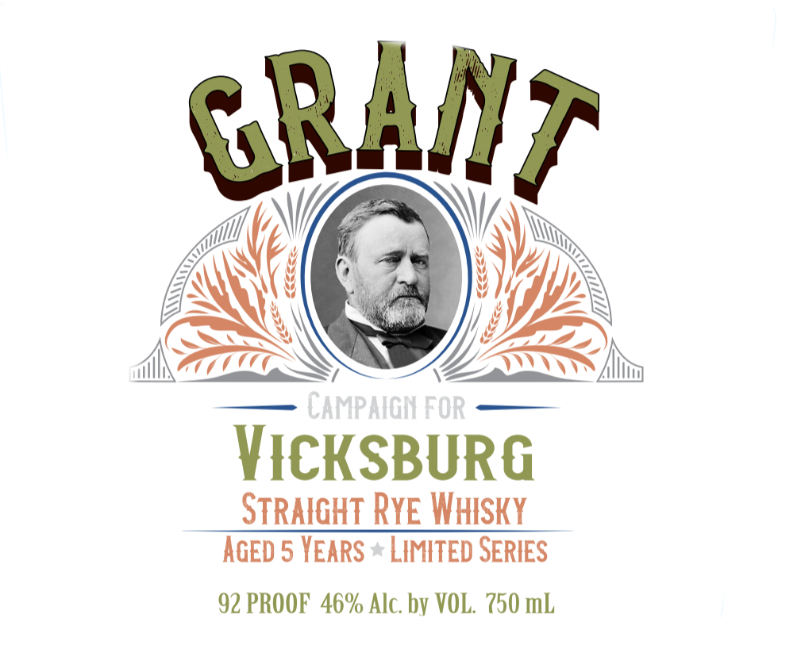

# TTB COLA Label Images - TTBID 26225001000235

**Brand Name:** GRANT

**Fanciful Name:** VICKSBURG STRAIGHT RYE WHISKY

**Issue Date:** 08/21/2026

**Origin Code:** 09

**Product Class/Type:** 102

**Source:** [TTB Public COLA Registry](https://ttbonline.gov/colasonline/viewColaDetails.do?action=publicFormDisplay&ttbid=26225001000235)

## Label Images

### Back Label

### Front Label

## Extracted Label Text

*Text extracted via OCR - may contain errors*

**Detected Proof:** 92
**Detected Age:** 5 Years

### Back Label

Originally founded in 1835, The New Richmond Distilleries used the
harvest in plenty for that season and year making each batch unique:
This approach provided a greater variety of flavors and complexity that
was common in the pre-prohibition era. This bottle continues our
Harvest-Based Distillery philosophy and celebrates US. Grant'$
victorious Campaign for Vicksburg in our series celebrating Grant'$
200th Birthday just 5 miles from his birthplace:
GOVERNMENT WARNING:
(1) According
to
the
Surgeon
General,
women
should
not
drink
alcoholic
beverages
pregnancy
because
of
60009
36232
the risk of birth defects.
(2)
Consumption
of
alcoholic
beverages impairs your ability
Produced by The New
to
drive
a
car
or
operate
Richmond Distilleries,
machinery;
and
may
cause
New Richmond, OH
health problems.
during

### Front Label

GRANt
CAmpaIGN FOR
VIcKSBURG
STRAIGHT RyE Whsky
AGED 5 YEARS
LIMITED SERIES
92 PROOF 46% Alc. by VOL; 750 mL
