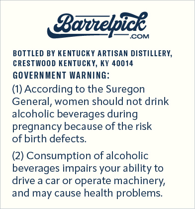
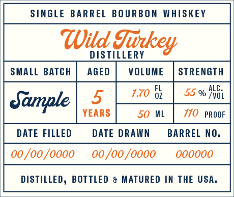

# TTB COLA Label Images - TTBID 26225001000252

**Brand Name:** BARRELPICK

**Issue Date:** 08/31/2026

**Origin Code:** 22

**Product Class/Type:** 141

**Source:** [TTB Public COLA Registry](https://ttbonline.gov/colasonline/viewColaDetails.do?action=publicFormDisplay&ttbid=26225001000252)

## Label Images

### Back Label

### Front Label

### Label 3

## Extracted Label Text

*Text extracted via OCR - may contain errors*

*1 image(s) excluded: text did not meet readability threshold*

**Detected Proof:** 110

### Back Label

Bovelice
COM
BOTTLED BY KENTUCKY ARTISAN DISTILLERY;
CRESTWOOD KENTUCKY, KY 40014
GOVERN MENT WARNING:
(1) According to the Suregon
General; women should not drink
alcoholic beverages during
pregnancy because of the risk
of birth defects:
(2) Consumption of alcoholic
beverages impairs your ability to
drive a car or operate
machinery;
and may cause health problems

### Front Label

SINGLE BARREL
BO URBON WHISKEY
Wild
DIS TILLERY
TiEkey
SMALL BATCH
AGED
VOL UME
STRENGTH
5
1.70
6z
55 %
NVGi
Sample
YEARS
50 ML
710  PROOF
DATE FILLED
DATE DRAWN
BARREL NO.
00 /oo /000o
00 /oo /000o
0oooo0
DISTILLED, BOTTLED
& MATURED IN THE USA_
