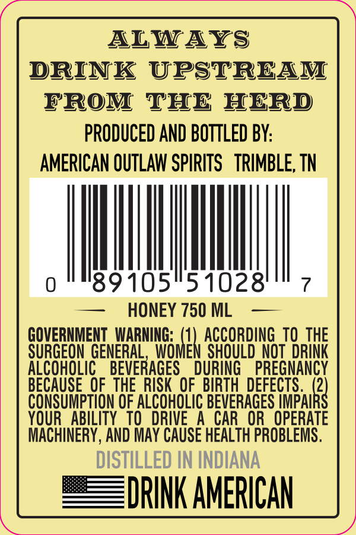
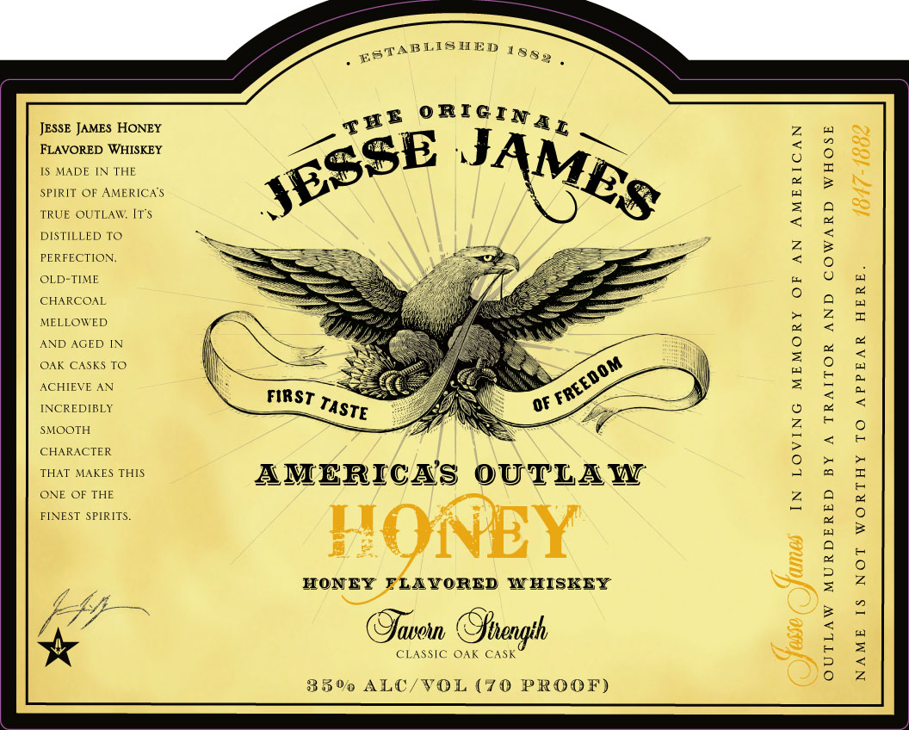

# TTB COLA Label Images - TTBID 26225001000588

**Brand Name:** JESSE JAMES

**Fanciful Name:** HONEY

**Issue Date:** 08/21/2026

**Origin Code:** 43

**Product Class/Type:** 149

**Source:** [TTB Public COLA Registry](https://ttbonline.gov/colasonline/viewColaDetails.do?action=publicFormDisplay&ttbid=26225001000588)

## Label Images

### Back Label

### Front Label

### Label 3

## Extracted Label Text

*Text extracted via OCR - may contain errors*

*1 image(s) excluded: text did not meet readability threshold*

**Detected Proof:** 140

### Back Label

ALWAYS
DRINK UPSTREAM
rrOM THE HERD
PRODUCED AND BOTTLED BY:
AMERICAN OUTLAW SPIRITS   TRIMBLE, TN
0
89105
51028
HONEY 750 ML
GOVERNMENI WARNING: (1) ACCORDING TO THE
SURGEON GENERAL
WOMEN SHOULD_Not  DRINK
ALCOHOLIC
BEVERAGES
DURING
PREGNANCY
BECAUSE  OF  THE RISK OF . BIRTH  DEFECTS .   (2)
CONSUMPTION OF ALCOHOLIC BEVERAGES IMPAIRS
YOUR   ABILITYTO
DRIVE
A CAR OR  OPERATE
MACHINERY , AND MAY CAUSE HEALTH PROBLEMS.
DISTILLED IN INDIANA
DRINK AMERICAN

### Front Label

EFTABLISIED
JESSE JAMES HONEY
FLAVORED WHISKEY
MADE
IN THE
H
SPIRIT OF AMERICA$
TRUE
OUTLAW; Mr$
DISTILLED T0
2
1
PERFECTION:
OLD-TIME
CHARCOAL
6
;
MELLOWED
4
AND
AGED
OAK CASKS TO
1
1
ACHIEVE
AN
FIRST
0f
1
INCREDIBLY
SMOOTH
2
CHARACTER
9
2
THAT MAKES THIS
AMERICAS
OUTLAW
ONE OF THE
2
1
FINEST
SPIRITS_
KONEY
1
HONEY
FLATORED W HISKEY
4
2
2
laoin @Jtien
68
i
850 ALC/VOL (70 PROOF)
188
0RIGINA L
TEE
JAMES
JESSE
'FREEDOM
TASTE
Gftength
