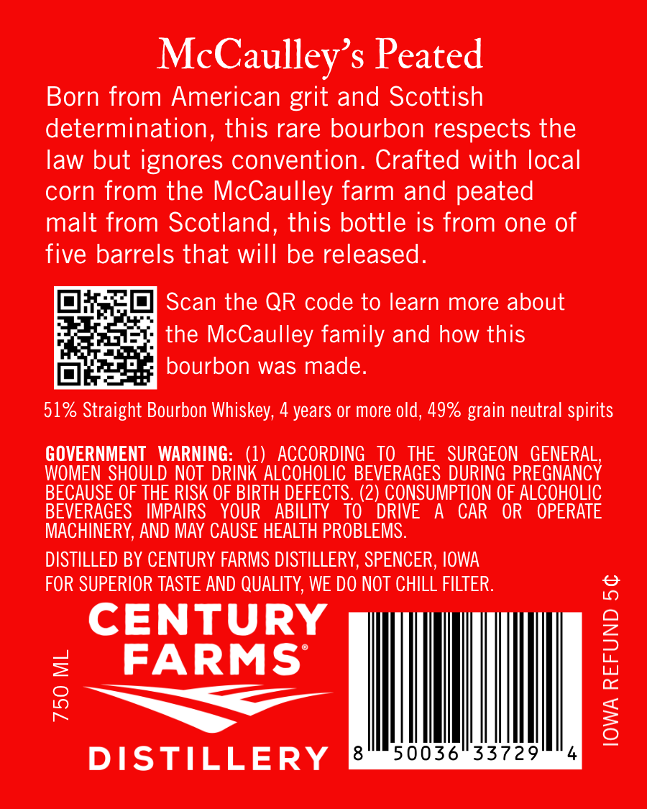
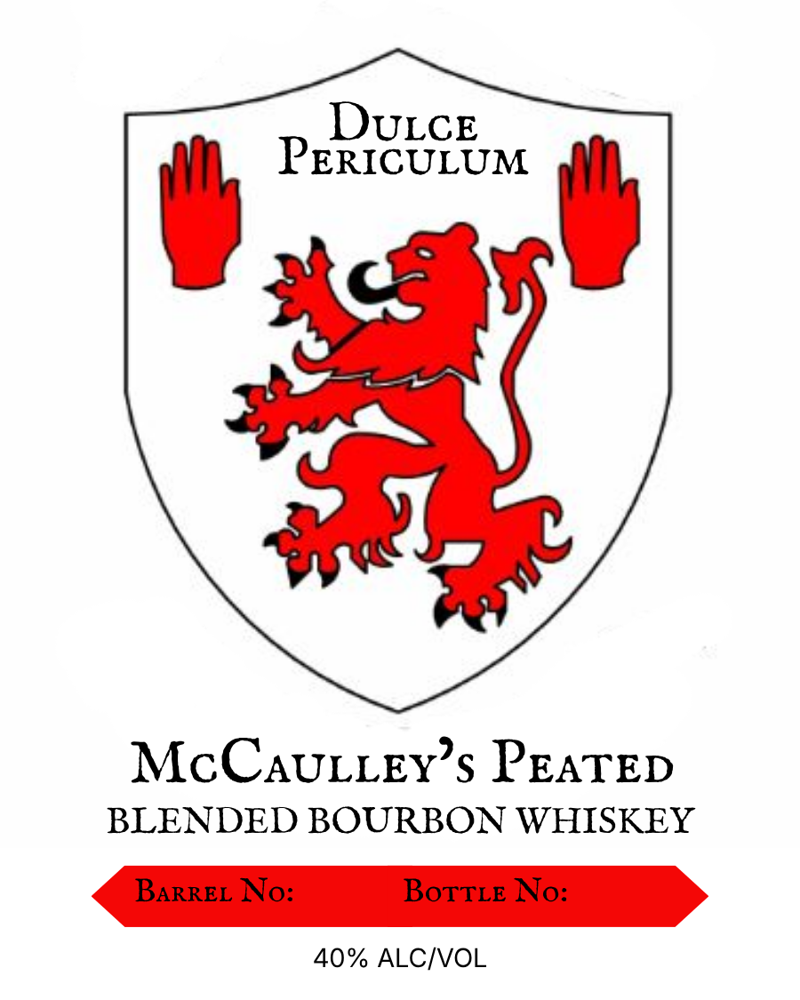

# TTB COLA Label Images - TTBID 26225001000606

**Brand Name:** MCCAULLEY'S PEATED

**Issue Date:** 09/08/2026

**Origin Code:** 20

**Product Class/Type:** 131

**Source:** [TTB Public COLA Registry](https://ttbonline.gov/colasonline/viewColaDetails.do?action=publicFormDisplay&ttbid=26225001000606)

## Label Images

### Back Label

### Front Label

## Extracted Label Text

*Text extracted via OCR - may contain errors*

**Detected Proof:** 80
**Detected Age:** 4 Years

### Back Label

McCaulley’s Peated

Born from American grit and Scottish
determination, this rare bourbon respects the
law but ignores convention. Crafted with local
corn from the McCaulley farm and peated
malt from Scotland, this bottle is from one of
five barrels that will be released.

Scan the QR code to learn more about
the McCaulley family and how this
bourbon was made.

51% Straight Bourbon Whiskey, 4 years or more old, 49% grain neutral spirits

GOVERNMENT WARNING: (1) ACCORDING TO THE SURGEON GENERAL,
WOMEN SHOULD NOT DRINK ALCOHOLIC BEVERAGES DURING PREGNANCY
BECAUSE OF THE RISK OF BIRTH DEFECTS. (2) CONSUMPTION OF ALCOHOLIC
BEVERAGES IMPAIRS YOUR ABILITY TO DRIVE A CAR OR OPERATE
MACHINERY, AND MAY CAUSE HEALTH PROBLEMS.

DISTILLED BY CENTURY FARMS DISTILLERY, SPENCER, IOWA
FOR SUPERIOR TASTE AND QUALITY, WE DO NOT CHILL FILTER.

CENTURY
FARMS

ae

DISTILLERY

750 ML

IOWA REFUND 5¢

### Front Label

DULCE
PERICULUM
McCAULLEY s PEATED
BLENDED BOURBON WHISKEY
BARREL No:
BoTTLE No:
40% ALCIVOL
