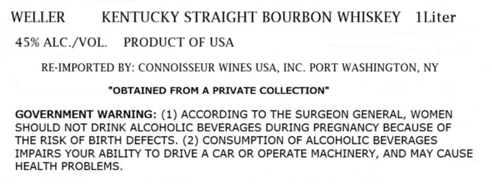
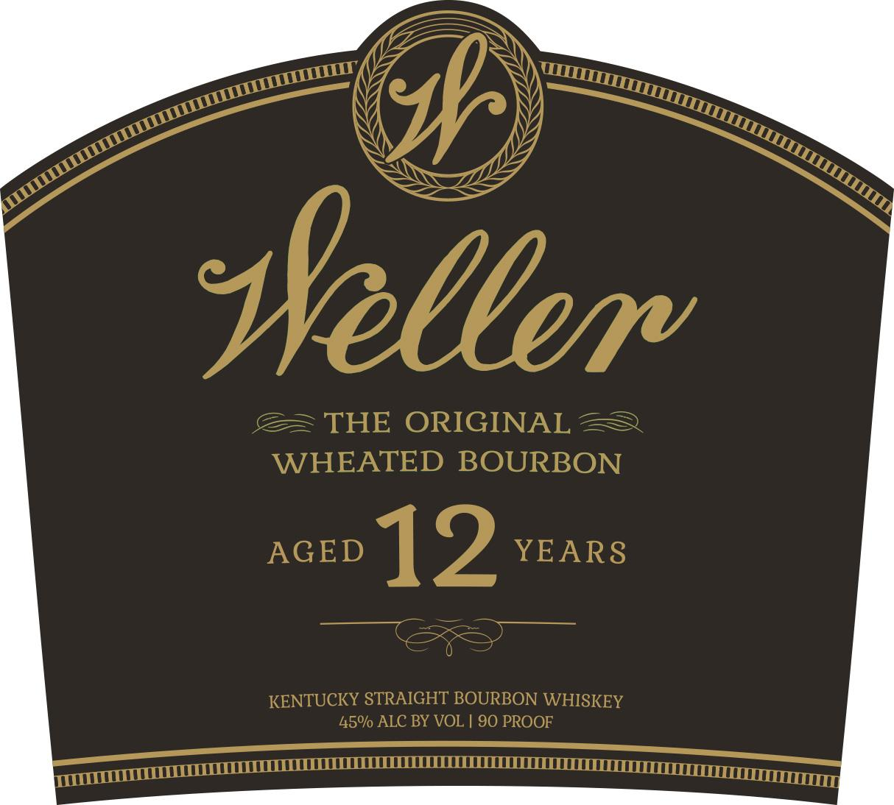

# TTB COLA Label Images - TTBID 26225001000616

**Brand Name:** WELLER

**Fanciful Name:** AGED 12 YEARS

**Issue Date:** 08/24/2026

**Origin Code:** 02

**Product Class/Type:** 101

**Source:** [TTB Public COLA Registry](https://ttbonline.gov/colasonline/viewColaDetails.do?action=publicFormDisplay&ttbid=26225001000616)

## Label Images

### Label 1

### Label 2

## Extracted Label Text

*Text extracted via OCR - may contain errors*

**Detected Proof:** 90
**Detected Age:** 2 Years

### Label 1

WELLER
KENTUCKY STRAIGHT BOURBON WHISKEY
ILiter
45% ALC /VOL
PRODUCT OF USA
RE-IMPORTED BY: CONNOISSEUR WINES USA
1
INC
PORT WASHINGTON
41
NY
"OBTAINED FROM A PRIVATE COLLECTION"
GOVERNMENT WARNING: (1) ACCORDING TO THE SURGEON GENERAL, WOMEN
SHOULD NOT DRINK ALCOHOLIC BEVERAGES DURING PREGNANCY BECAUSE OF
THE RISK OF BIRTH DEFECTS. (2) CONSUMPTION OF ALCOHOLIC BEVERAGES
IMPAIRS YOUR ABILITY TO DRIVE A CAR OR OPERATE MACHINERY, AND MAY CAUSE
HEALTH PROBLEMS.

### Label 2

pr

\)

ss

SS

\

SS

Ss

M7

oor ~ <we

@= THE ORIGINAL 2

WHEATED BOURBON

_ | 2 YEARS

KENTUCKY STRAIGHT BOURBON WHISKEY

45% ALC BY VOL | 90 PROOF

Witt

semeeeeeeTTTTC TT CCCI CLLEULLLLUO ULLAL LULL LLLLUCLOGUE COSTCO Tne
