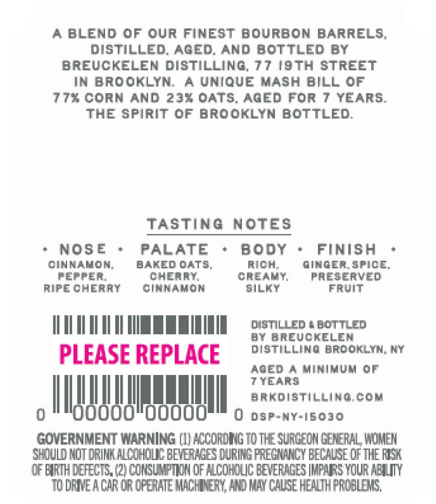
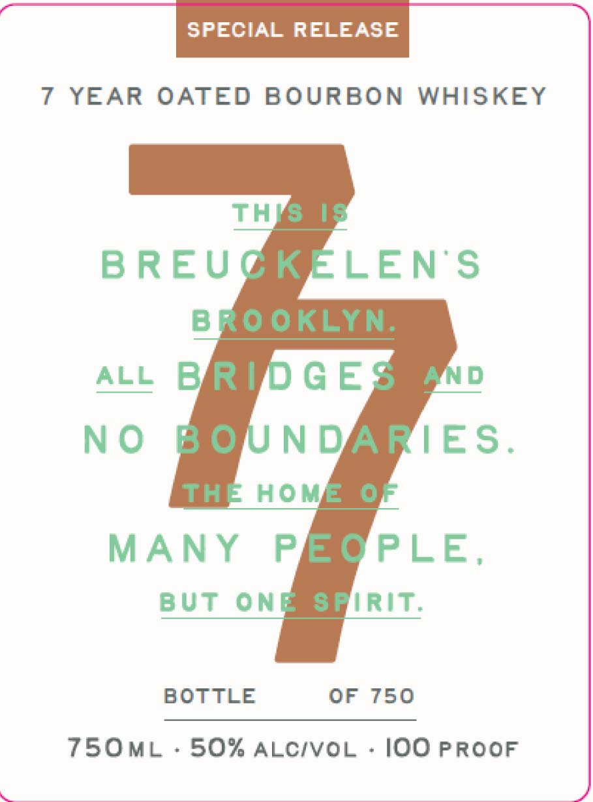
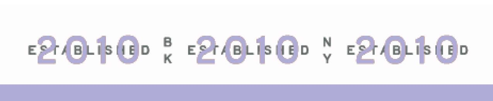

# TTB COLA Label Images - TTBID 26225001000622

**Brand Name:** 77 SPECIAL RELEASE 7 YEAR OATED BOURBON

**Issue Date:** 09/02/2026

**Origin Code:** 02

**Product Class/Type:** 141

**Source:** [TTB Public COLA Registry](https://ttbonline.gov/colasonline/viewColaDetails.do?action=publicFormDisplay&ttbid=26225001000622)

## Label Images

### Back Label

### Front Label

### Label 3

## Extracted Label Text

*Text extracted via OCR - may contain errors*

**Detected Age:** 7 Years

### Back Label

A BLEND 0F our FINEST bourBON BARRELS;
DISTILLED; AGED; AND BOTTLED BY
BREUCKELEN DISTILLINO
77 i9th STrEET
IN BROOKLYN;
A UNIQUE MASH BILL 0F
77x Corn AnD 23% oats, AGEd For 7 YEARS;
THE spirit 0F brooklyn BoTTLE;
TASTING
NOTES
NOSE
PALATE
BodY
FINISH
CINMAMOM;
DAKED OATS
rICH
OImOER_SFICE
pefFER
cheRAT
Creakt
preserved
rIpE CheRRY
CiknamON
WiLKT
FrvIT
disnLLed + bottled
BY BREUCRELEM
PLEASE REPLACE
distillinG brooklyn; NY
R0Ed 4 Mimimum 0F
7YEARS
hakdistilling Gom
0
ooooo"doooo
0
DSP-NY-[60J0
GQVERNMENT WarNING (1| KCCoRING MoT SuRCEIN GENERAL WOMEM
Shuld HOT DRINK algIHovc BEVETKGES [ VRING PEECMANCX BECHUEE @fTHE FISK
CF EIRTH deFECTS, (21 CONSUMPTIN @F HCOHOLIC BEVERAGES IMFARS YouR HELUITY
10 daeachr or opehe M4che3Y Hwd MMy ChLSe hewuthprdaleks,

### Front Label

SPECIAL RELEASE

7 YEAR OATED BOURBON WHISKEY

TH

BREUG

LENS

ALL

NO

IES

MANY P

PLE

BUT ON

IRIT

BOTTLE

OF 750

750ML - 50% acc/voc - lOO PROOF

### Label 3

POPE « BOE » BORG

NINN NNN
