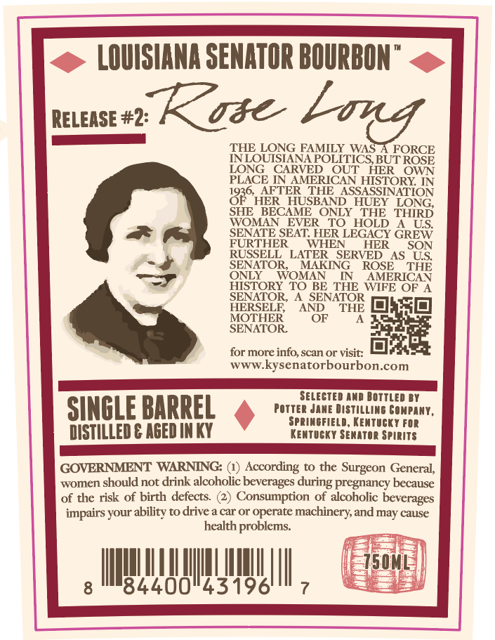
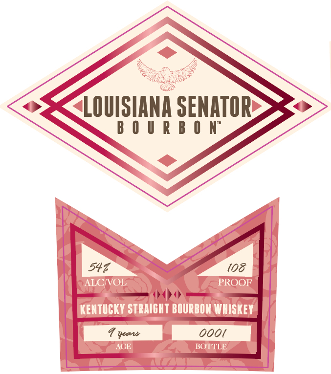

# TTB COLA Label Images - TTBID 26226001000016

**Brand Name:** LOUISIANA SENATOR BOURBON

**Issue Date:** 08/24/2026

**Origin Code:** 22

**Product Class/Type:** 101

**Source:** [TTB Public COLA Registry](https://ttbonline.gov/colasonline/viewColaDetails.do?action=publicFormDisplay&ttbid=26226001000016)

## Label Images

### Back Label

### Front Label

### Label 3

## Extracted Label Text

*Text extracted via OCR - may contain errors*

*1 image(s) excluded: text did not meet readability threshold*

### Back Label

LOUISIANA SENATOR BOURBON
RELEASE #2:
Kise
THE LONG FAMILY WAS A FORCE
NNLOUISIANA POLITICS BUT ROSE
LONG
CARVED
OUT
HER
OWN
PLACE JNAMERICAN HISTORY IN
836 HERER
THE
ASSASSINATION
HER_HUSBAND_HUEY LONG,
SHE   BECAME  ONLY
THE
THIRD
WOMAN
EVER
TO HOLD
US:
SENATE SEAT: HER LEGACY GREW
FURTHER
WHEN
HER
SON
RUSSELL   LATER
SERVED
AS_US
SENATOR,
MAKING
ROSE
ONLY
WOMAN
IN
HISTORY TO BE THE
WFERSAN
SENATOR,
A SENATOR
HERSELR;
AND
THE
MOTHER
OF
SENATOR
for more info, scan or visit:
jt
WWWkysenatorbourbon.com
SELECTED ND BOTTLEd BY
SINGLE BARREL
Potter Jane Distillimg Gonpany,
SPRIeFIeLd, KEMTUCK T FoR
DISTILLED € AGED INKY
KentuCKY SERATOR Spirits
GOVERNMENT WARNING:
According
to the
Surgeon General;
women
should not drink alcoholic beverages
pregnancy because
of the risk of birth defects:
Consumption of alcoholic beverages
impairs your ability to drive & car or operate machinery,and
cause
health problems:
750ML
84400"43196'
bing
THE
during
may

### Front Label

LOUISIANA SENATOR
B 0 U R B 0 N"
547
108
ALCVOL
PROOF
KENtuCKY STRAICHT BOURBON WHISKEY
Veas
ooot
AGE
BOTTLE
