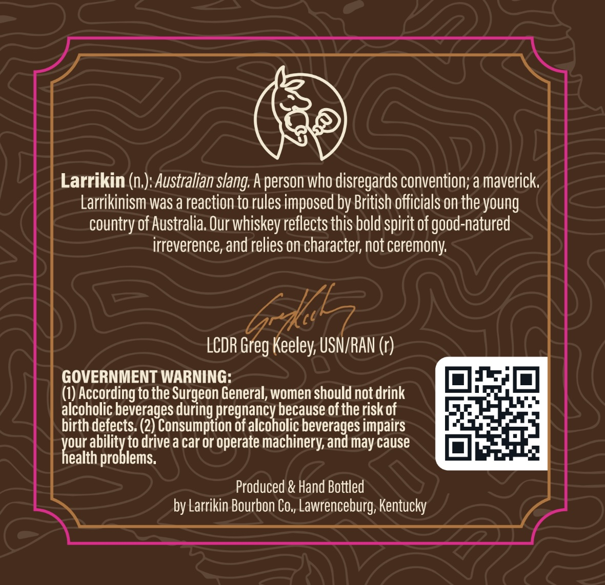
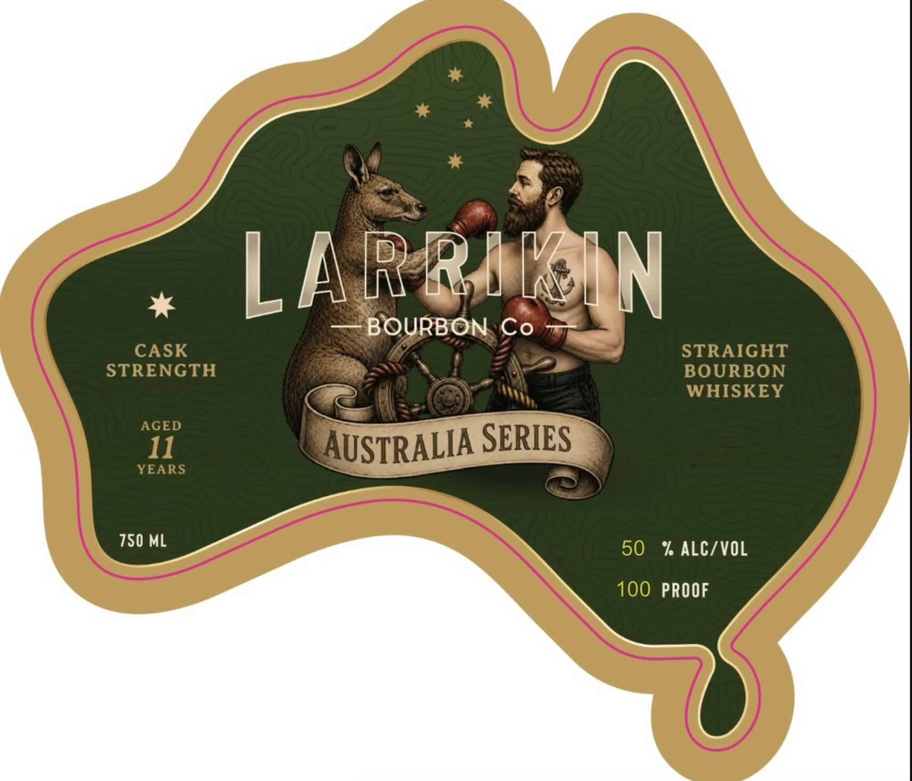

# TTB COLA Label Images - TTBID 26226001000017

**Brand Name:** LARRIKIN BOURBON CO

**Fanciful Name:** AUSTRALIA SERIES

**Issue Date:** 08/24/2026

**Origin Code:** 22

**Product Class/Type:** 101

**Source:** [TTB Public COLA Registry](https://ttbonline.gov/colasonline/viewColaDetails.do?action=publicFormDisplay&ttbid=26226001000017)

## Label Images

### Back Label

### Front Label

## Extracted Label Text

*Text extracted via OCR - may contain errors*

**Detected Proof:** 100

### Back Label

Larrikin (n,): Australian s/ang. A person who disregards convention; a maverick

Larrikinism was a reaction to rules imposed by British officials on the young

country of Australia. Our whiskey reflects this bold spirit of good-natured

irreverence, and relies on character, not ceremony.

LCDR Gb La (1)

GOVERNMENT WARNING:

LL==,]

PLT)

(1) According to the Surgeon General, women should not drink

i

a

alcoholic beverages during pregnancy because of the risk of

Ee

birth defects. (2) Consumption of alcoholic beverages impairs

our abilit

cal

b

lems.

to drive a car or operate machinery, and may cause

z

ealth pro

Produced & Hand Bottled

by Larrikin Bourbon Co,, Lawrenceburg, Kentucky

### Front Label

LARRIEAIN
BOURBON Co
CASK
STRAIGHT
STRENGTH
BOURBON
WHISKEY
AGED
11
AUSTRALIA SERIES
YEARS
750 ML
50
% ALCZVOL
100 PROOF
