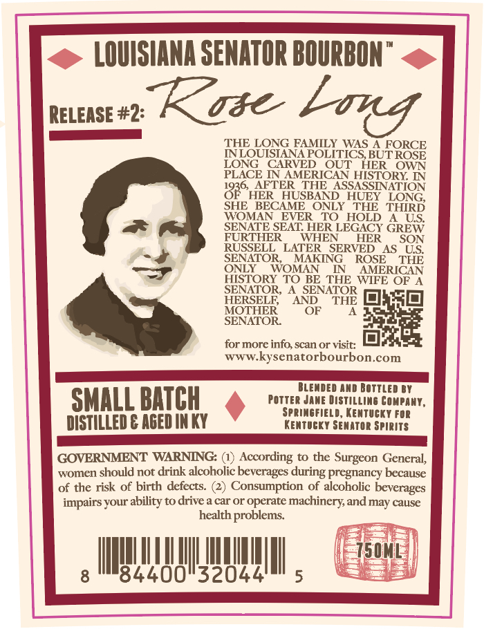
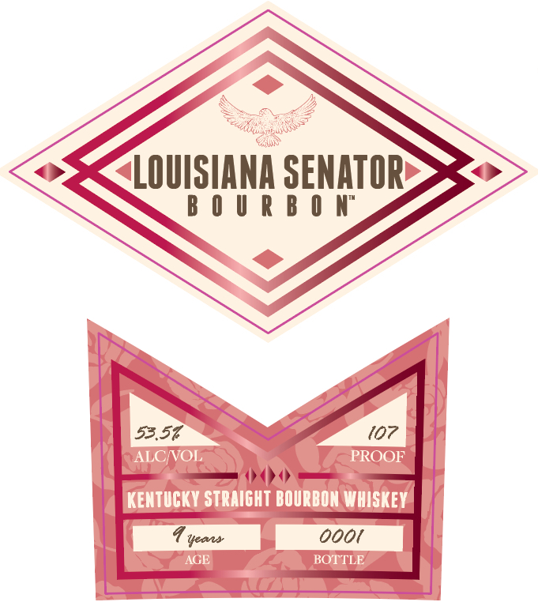

# TTB COLA Label Images - TTBID 26226001000018

**Brand Name:** LOUISIANA SENATOR BOURBON

**Issue Date:** 08/24/2026

**Origin Code:** 22

**Product Class/Type:** 101

**Source:** [TTB Public COLA Registry](https://ttbonline.gov/colasonline/viewColaDetails.do?action=publicFormDisplay&ttbid=26226001000018)

## Label Images

### Back Label

### Front Label

### Label 3

## Extracted Label Text

*Text extracted via OCR - may contain errors*

*1 image(s) excluded: text did not meet readability threshold*

### Back Label

LOUISIANA SENATOR BOURBON
RELEASE #2:
Kose
THE LONG FAMILY WAS A FORCE
NNLQUISIANAPOLITICS BUTROSE
LONG
CARVED
RVERIOXF
HER
OWN
PLACE IN
HISTORY
836
AFTER THE_ASSASSINATION
HER   HUSBAND_HLEY LONG,
SHE
BECAME
ONLY
THE   THIRD
WOMAN
EVER
HOLD
4 US
SENATE SEAT HER LEGACY GREW
FURTHER
WHEN
HER
SON
RUSSELL
LATER  SERVED_AS LS
SENATOR
MAKING
ROSE
THE
ONLY
WOMAN
IN
AMERICAN
HISTORY TO BE THE WIFE OF A
SENATOR, A SENATOR
HERSELF
AND
THE
DHHD
MOTHER
OF
SENATOR
for more info, scan or visit:
WWWL
kysenatorbourbon.com
BLEMDED AND BOTtLED
SMALL BATCH
Potter Jawe Distilling Compant,
SPRingFieLd, Kentucky FdR
DISTILLED € AGED IN KY
KENtUGKY Senator spirits
GOVERNMENT WARNING:
According to the Surgeon General,
women should not drink alcoholic beverages during pregnancy because
of the risk of birth defects:
Consumption of alcoholic beveragcs
impairs your ability to drive a car or operate
machineryand may cause
health problems
~5ML
8
84400"32044
5
bovg
TO

### Front Label

LOUISIANA SENATOR
B 0 U R B 0 N"
53.57
107
ALCVOL
PROOF
KENTUCKY STRAIGHT BOURBON WHISKEY
Ueas
0ooi
AGE
BOTTLE
