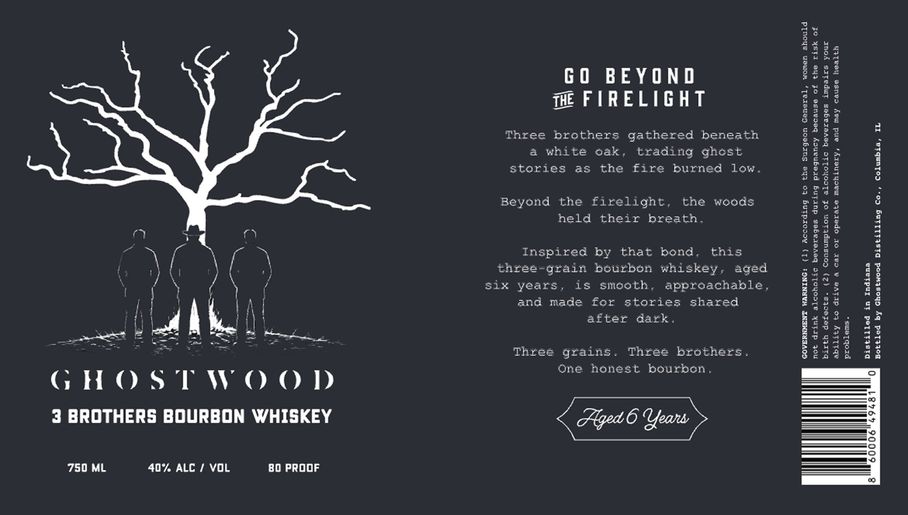

# TTB COLA Label Images - TTBID 26226001000037

**Brand Name:** GHOSTWOOD

**Fanciful Name:** 3 BROTHERS

**Issue Date:** 09/18/2026

**Origin Code:** 04

**Product Class/Type:** 141

**Source:** [TTB Public COLA Registry](https://ttbonline.gov/colasonline/viewColaDetails.do?action=publicFormDisplay&ttbid=26226001000037)

## Label Images

### Label 1

## Extracted Label Text

*Text extracted via OCR - may contain errors*

**Detected Proof:** 80

### Label 1

GHOSTWOOD
3 BROTHERS BOURBON WHISKEY

750 ML 40% ALC / VOL 80 PROOF

GO BEYOND
THE FIRELIGHT

Three brothers gathered beneath
a white oak, trading ghost
stories as the fire burned low.

Beyond the firelight. the woods
held their breath.

Inspired by that bond. this
three-grain bourbon whiskey, aged

six years, is smooth, approachable,

and made for stories shared
after dark.

Three brothers.
One honest bourbon.

Three grains.

=|
pI
3
2
‘i
5
Fi
€
g
g
r]
Fi
4
a
§
&
&
§
Hy
$
Hy
a
a
g
8
8
o>
g
5
3
i
8
Hy
g
&
5
5
=
BS

not drink alcoholic beverages during pregnancy because of the risk of
birth defects. (2) Consumption of alcoholic beverages impairs your
ability to drive a car or operate machinery, and may cause health

problems.

Distilled in Indiana

Bottled by Ghostwood Distilling Co., Columbia, IL
