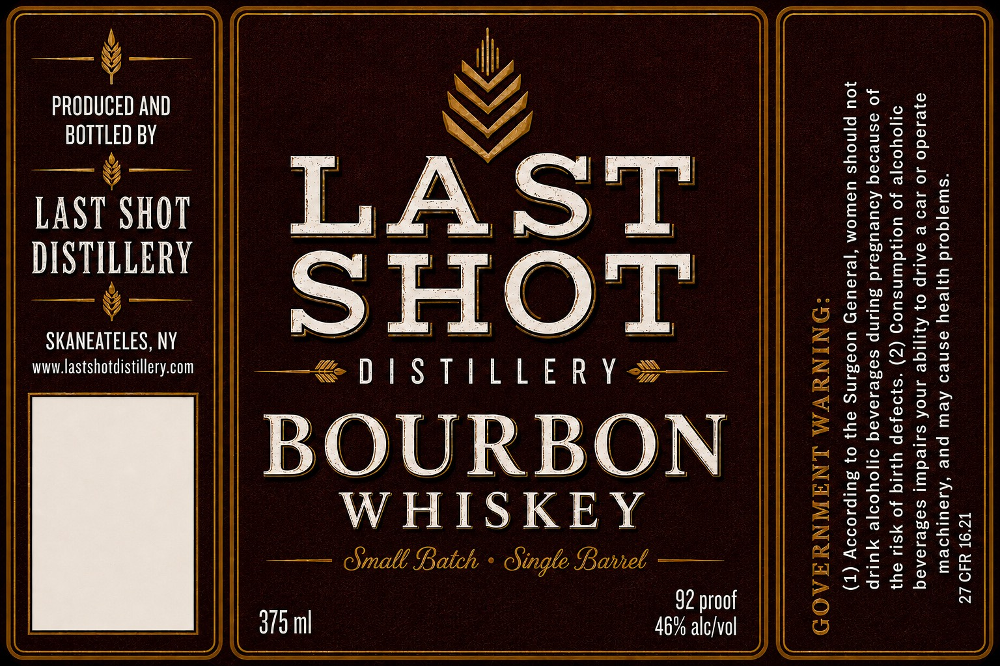

# TTB COLA Label Images - TTBID 26226001000049

**Brand Name:** LAST SHOT DISTILLERY

**Issue Date:** 09/01/2026

**Origin Code:** 02

**Product Class/Type:** 141

**Source:** [TTB Public COLA Registry](https://ttbonline.gov/colasonline/viewColaDetails.do?action=publicFormDisplay&ttbid=26226001000049)

## Label Images

### Label 1

## Extracted Label Text

*Text extracted via OCR - may contain errors*

**Detected Proof:** 92

### Label 1

U
Sie a ¥ scans
PRODUCED AND
BOTTLED BY

U

LAST SHOT
DISTILLERY

pase el % a
SKANEATELES, NY

www.lastshotdistillery.com

| 375ml

Rent aad 2

BOURBON
WHISKEY
—— Small Batch > Single Barrel ——

92 proof
46% alc/vol

|| GOVERNMENT WARNING:

(1) According to the Surgeon General, women should not

drink alcoholic beverages during pregnancy because of
the risk of birth defects. (2) Consumption of alcoholic

beverages impairs your ability to drive a car or operate

machinery, and may cause health problems.

27 CFR 16.21

NS
