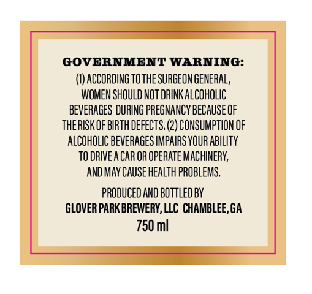
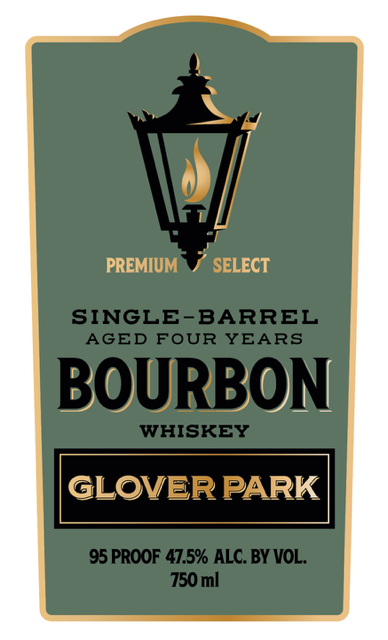

# TTB COLA Label Images - TTBID 26226001000062

**Brand Name:** GLOVER PARK BOURBON WHISKEY

**Issue Date:** 08/27/2026

**Origin Code:** 08

**Product Class/Type:** 141

**Source:** [TTB Public COLA Registry](https://ttbonline.gov/colasonline/viewColaDetails.do?action=publicFormDisplay&ttbid=26226001000062)

## Label Images

### Back Label

### Label 1

## Extracted Label Text

*Text extracted via OCR - may contain errors*

**Detected Proof:** 95

### Back Label

GOVERNMENT WARNING:
ACCORDING TOTHE SURGEON GENERAL,
WOMEN SHOULD NOT DRINK ALCOHOLIC
BEVERAGES DURING PREGMANCY beCauSe OF
thERISK OF BIRTH Defects. (2) CONSUMPTION OF
ALCOHOLIC BEVERAGES IMPAIRS YOUR AbILITY
TO DRIVEA CAR OR OpeRATe MACHINERV;
AND MaY Cause HeaLTh PROBLEMS,
PRODUCED AND BOTTLEdBY
GLOVERPARK BREWERY, LLC CHAMBLEE, GA
750 ml

### Label 1

PREMIUM
SELECT
SINGLE-BARREL
AGED FOUR YEARS
BOURBON
WHISKEY
GLOVER PARK
95 PROOF 47.5% ALC.BY VOL _
750 ml
