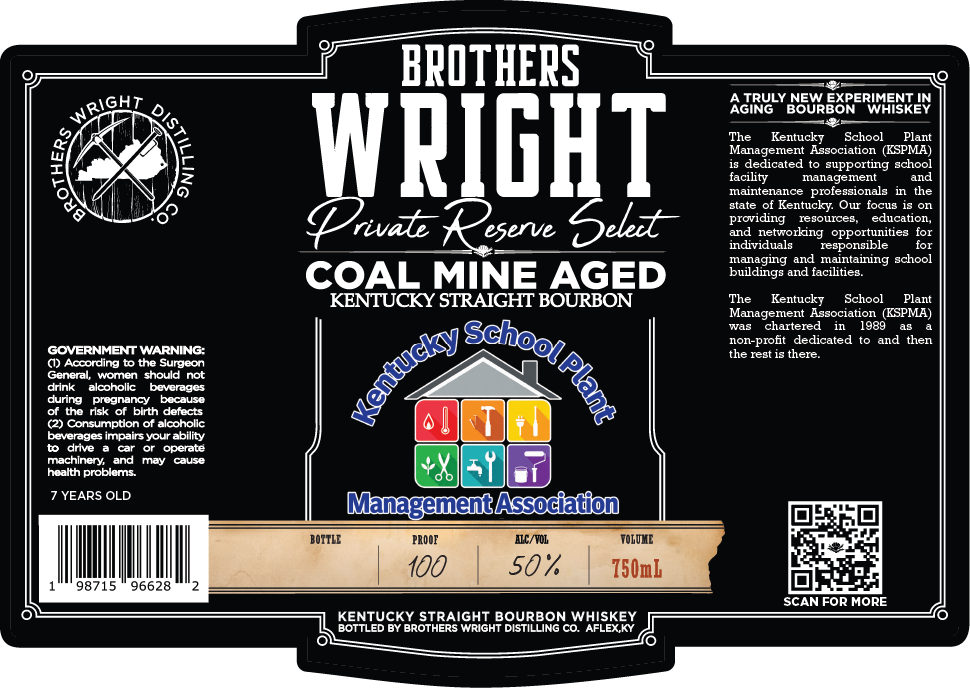

# TTB COLA Label Images - TTBID 26226001000090

**Brand Name:** PRIVATE RESERVE SELECT

**Issue Date:** 08/27/2026

**Origin Code:** 22

**Product Class/Type:** 101

**Source:** [TTB Public COLA Registry](https://ttbonline.gov/colasonline/viewColaDetails.do?action=publicFormDisplay&ttbid=26226001000090)

## Label Images

### Label 1

## Extracted Label Text

*Text extracted via OCR - may contain errors*

### Label 1

BPOTHEPS
IGHT
AGIRY
TRULY NEW EXPERIMENT IN
Ne
BOURBON
WHISKEY
The
Kentucky
School
Plant
WPICHT
Madadiated to soppoctg schco?
facility
Ianadement
and
mnaintenance
professionals in
the
Btate
of Kentucky Owr focus is on
rivale
eserve
Sldt
pId  detgorkanguopportudteatioor
individuals
responsible
for
managing and maintaining school
COAL MINE AGED
buildings and facilities
KENTUCKY STRAIGHT BOURBON
The
Kentucky
School
Plant
Management Association (KSPMA)
Tas
Chartered
1989
non-pront
dedicated
and then
GOVERNMENT WARNING:
the rest 15 there:
() According t0 the Surgeon
General
woren should not
drnk
alcoholic
Deverade
dunng
pregnancy
bocause
orthe
rlsk or blrth defects
(2) Consumpton or alcoholic
beverages impairs your ability
drive
operate
machinery_and
Fnay
cause
health problems
YEARS OLD
MagquentAssodatiod
BOITLE
PROOE
MC/YOL
TOLQHE
100
50
750mL
98715
96628
SCAN FOR MORE
KENTUCKY STRAIGHT BOURBON WHISKEY
BOTTLED BY BrotheRS Wright DISTILLING CO. AFLEX KY
9
8
gehhodl;
ventucly
1
