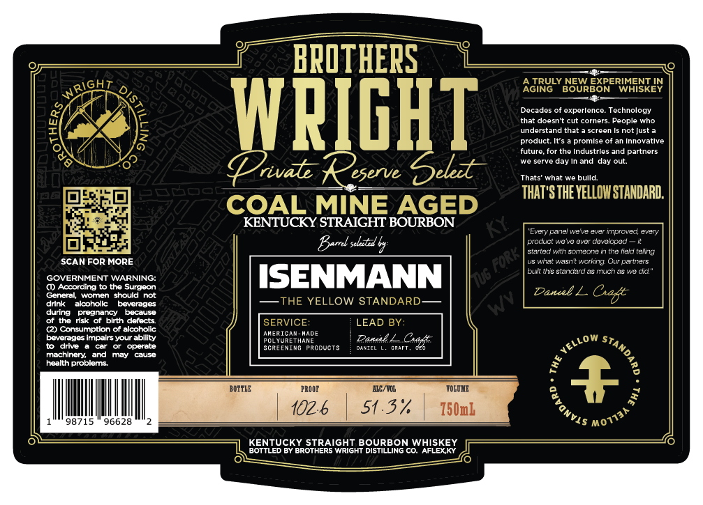

# TTB COLA Label Images - TTBID 26226001000095

**Brand Name:** PRIVATE RESERVE SELECT

**Issue Date:** 08/25/2026

**Origin Code:** 22

**Product Class/Type:** 101

**Source:** [TTB Public COLA Registry](https://ttbonline.gov/colasonline/viewColaDetails.do?action=publicFormDisplay&ttbid=26226001000095)

## Label Images

### Label 1

## Extracted Label Text

*Text extracted via OCR - may contain errors*

### Label 1

BPOTHERS
AGIRU
TRULY
BSUREORERIMESKEN
NEW
WPIGHT
[heat doesoft cutecoeners.
Teebpotogho
understand that
screen
not Just a
product. It$
promlse of an Innovatlve
future forthe Industrles and partners
seive day
and day out
Vrivate
eserve
Seledt
Thats' what we bulld:
THAT'STHE YELLOHSTANDARD:
COAL MINE AGED
KENTUCKY STRAIGHT BOURBON
canel Kreve ever #prcved
Bard sehddd
poduct wcvc OVEI
Osedce
StantedMhscteona
tne el telng
SCAN FOR MORE
USwhatwasn
Wonno
Our partrers
#is standard as mch
moda"
GOVERNMENT WARNING:
ISENMANN
06
Q) Accordina t0 the Surgeon
Dael L
General}women_should not
drink
akcoholk
beverages
THE YELLOW STANDARD
during
pregnancy
because
of tho rlsk of blrth dafects
SERVICE=
LEAD BY:
(2) Consumption ot alcoholic
CRidan
Hede
beverages impairs your ability
Sueetuene
Daual L
Ca
0w
drive
operate
GcRCEuI
PRUDUD
DancBI
CaaeI
machinery:
and
may
Clse
health problems
BOITLE
PROQE
IC/VOL
TOLouE
5
102.6
51.3
750mk
98715
96628
KENTUCKY StRAiGHT BOURBON WHISKEY
BOTTLED BY BrOTHERS WriGHt DISTILLING CO. AFLEXKY
1
Every
Gu0y
Fork/
L
Caft
)
VELLC
1
8
VONVIS
'M07731
