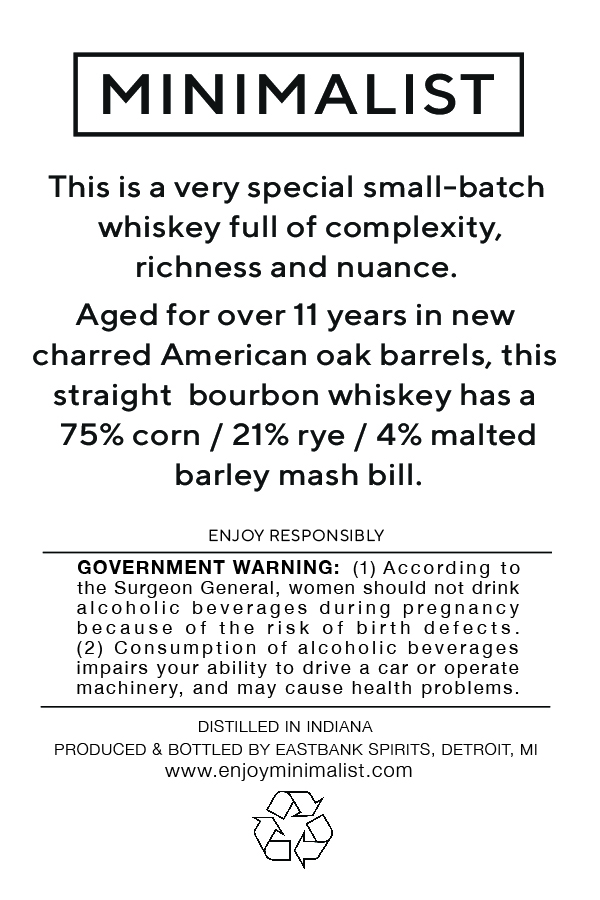
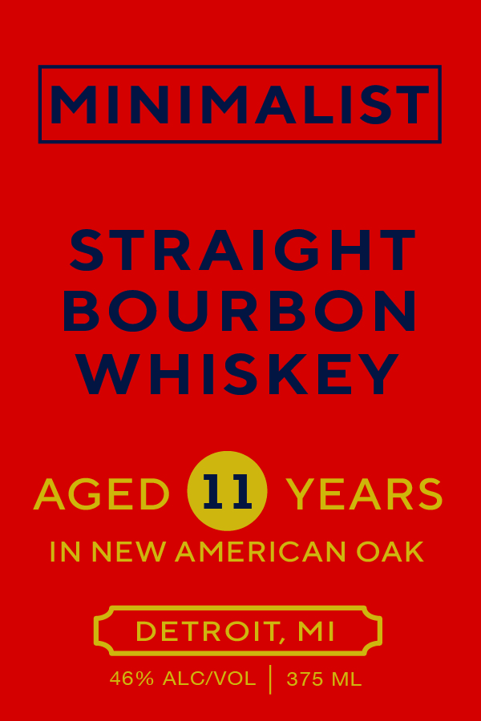

# TTB COLA Label Images - TTBID 26226001000159

**Brand Name:** MINIMALIST

**Fanciful Name:** 11 YEAR OLD STRAIGHT BOURBON WHISKEY

**Issue Date:** 08/24/2026

**Origin Code:** 06

**Product Class/Type:** 101

**Source:** [TTB Public COLA Registry](https://ttbonline.gov/colasonline/viewColaDetails.do?action=publicFormDisplay&ttbid=26226001000159)

## Label Images

### Back Label

### Front Label

## Extracted Label Text

*Text extracted via OCR - may contain errors*

**Detected Proof:** 92
**Detected Age:** 11 Years

### Back Label

MINIMALIST

This is a very special small-batch
whiskey full of complexity,
richness and nuance.

Aged for over 11 years in new
charred American oak barrels, this
straight bourbon whiskey has a
75% corn / 21% rye / 4% malted
barley mash bill.

ENJOY RESPONSIBLY

GOVERNMENT WARNING: (1) According to
the Surgeon General, women should not drink
alcoholic beverages during pregnancy
because of the risk of birth defects.
(2) Consumption of alcoholic beverages
impairs your ability to drive a car or operate
machinery, and may cause health problems.

DISTILLED IN INDIANA
PRODUCED & BOTTLED BY EASTBANK SPIRITS, DETROIT, MI
www.enjoyminimalist.com

LAY

&Y

### Front Label

MINIMALIST
STRAIGHT
BOURBON
WHISKEY
AGED
11
YEARS
IN NEW AMERICAN OAK
DETROIT,
MI
46% ALCIVOL
375 ML
