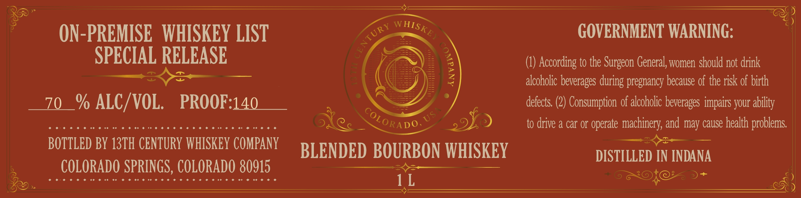

# TTB COLA Label Images - TTBID 26226001000290

**Brand Name:** 13TH CENTURY WHISKEY COMPANY

**Issue Date:** 08/25/2026

**Origin Code:** 13

**Product Class/Type:** 131

**Source:** [TTB Public COLA Registry](https://ttbonline.gov/colasonline/viewColaDetails.do?action=publicFormDisplay&ttbid=26226001000290)

## Label Images

### Back Label

## Extracted Label Text

*Text extracted via OCR - may contain errors*

**Detected Proof:** 140

### Back Label

ON-PREMISE   WHISKEY LIST
GOVERNMENT WARNING:
SPECIAL RELEASE
According to the Surgeon General, women should not drink
alcoholic beverages during pregnancy because of the risk of birth
70
% ALC/ VOL.
PROOF:140
defects. (2) Consumption of alcoholic beverages impairs your
to drive & car or operate
machinery; and may cause health problems:
BOTTLED BY 13TH CENTURY WHISKEY COMPANY
BLENDED BOURBON WHISKEY
DISTILLED IN INDANA
COLORADO SPRINGS, COLORADO 80915
1 L
WHISKE }
CENTURY
1
ability
COLORADO`
US
