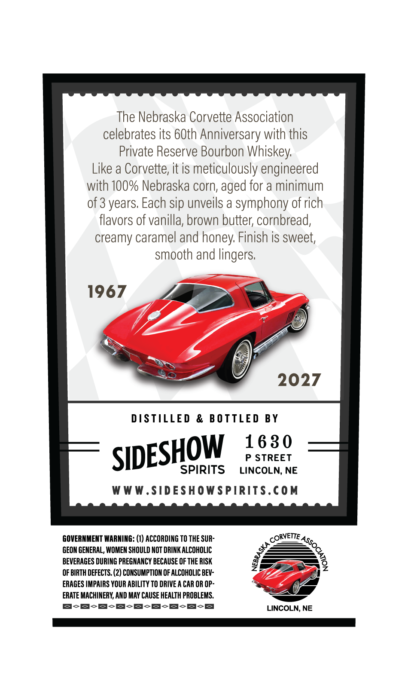
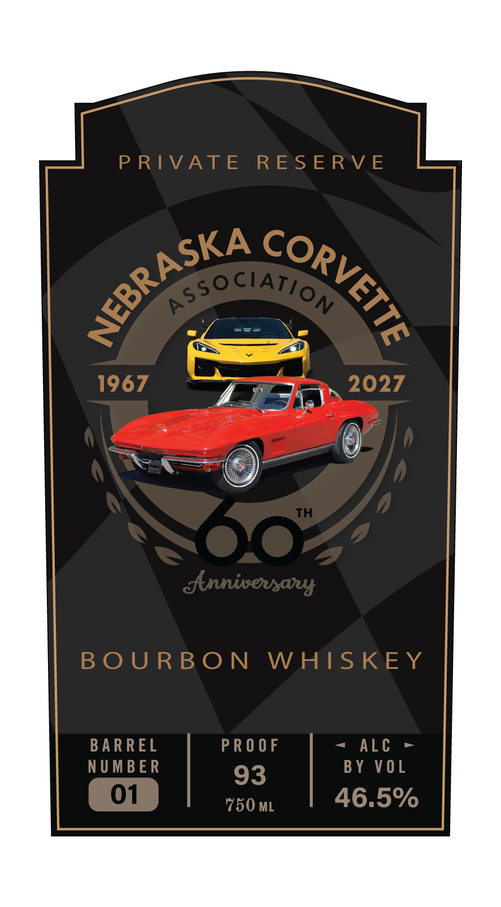

# TTB COLA Label Images - TTBID 26226001000301

**Brand Name:** NEBRASKA CORVETTE ASSOCIATION

**Issue Date:** 08/24/2026

**Origin Code:** 31

**Product Class/Type:** 141

**Source:** [TTB Public COLA Registry](https://ttbonline.gov/colasonline/viewColaDetails.do?action=publicFormDisplay&ttbid=26226001000301)

## Label Images

### Back Label

### Front Label

## Extracted Label Text

*Text extracted via OCR - may contain errors*

**Detected Proof:** 93
**Detected Age:** 3 Years

### Back Label

The Nebraska Corvette Association

celebrates its 60th Anniversary with this

Private Reserve Bourbon Whiskey.

Like a Corvette, it is meticulously engineered

with 100% Nebraska corn, aged for a minimum

of 3 years. Each sip unveils a symphony of rich

flavors of vanilla, brown butter, cornbread,

creamy caramel and honey. Finish is sweet,

smooth and lingers.

1967

evs

eS,

I

A

2027

DISTILLED & BOTTLED BY

1630

P STREET

SID

ESHOW

SPIRITS

LINCOLN, NE

WWW.SIDESHOWSPIRITS.COM

GOVERNMENT WARNING: (1) ACCORDING TO THE SUR

CORETTE,

GEON GENERAL, WOMEN SHOULD NOT DRINK ALCOHOLIC

BEVERAGES DURING PREGNANCY BECAUSE OF THE RISK

OF BIRTH DEFECTS. (2) CONSUMPTION OF ALCOHOLIC BEV-

NZ

3]

ERAGES IMPAIRS YOUR ABILITY TO DRIVE A CAR OR OP-

ERATE MACHINERY, AND MAY CAUSE HEALTH PROBLEMS.

B-S-S-S-S-S-S-S-sS

LINCOLN, NE

ee

### Front Label

P RIVATE
RES ERV E
Rssoc ATion
1967
2027
TH
dnnivevsaey
B O U RB O N
W HISKEY
BAR REL
P R 0 0 F
ALc
N UMBE R
BY VOL
93
01
750 ML
46.5%
NEBRASKA
CORVETTE
