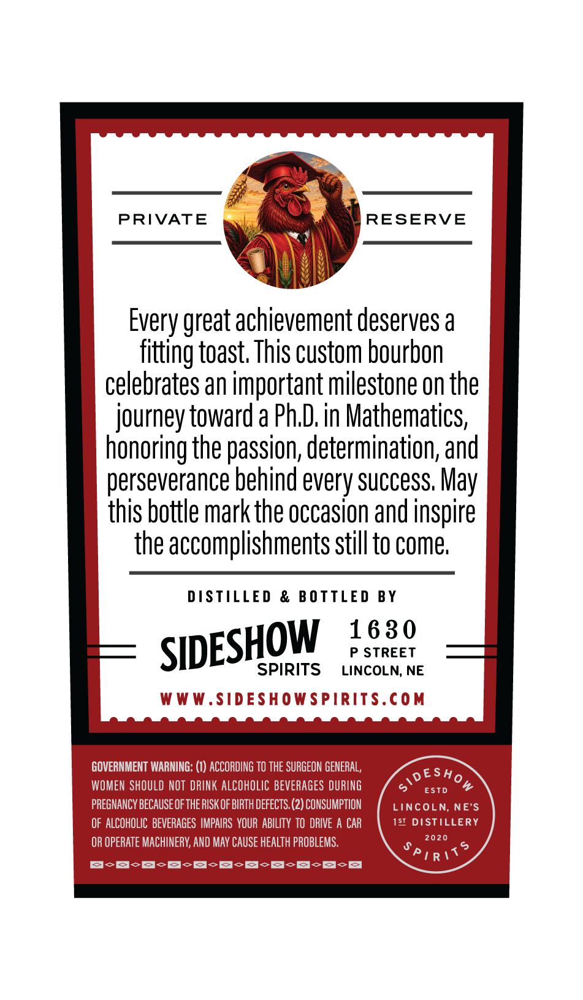
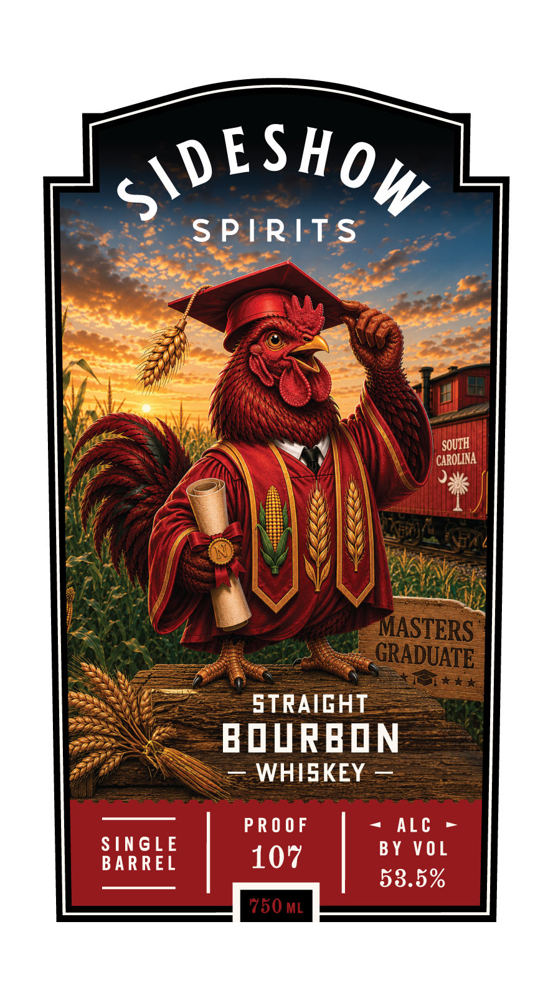

# TTB COLA Label Images - TTBID 26226001000303

**Brand Name:** SIDESHOW SPIRITS

**Issue Date:** 09/14/2026

**Origin Code:** 31

**Product Class/Type:** 101

**Source:** [TTB Public COLA Registry](https://ttbonline.gov/colasonline/viewColaDetails.do?action=publicFormDisplay&ttbid=26226001000303)

## Label Images

### Back Label

### Front Label

## Extracted Label Text

*Text extracted via OCR - may contain errors*

**Detected Proof:** 107

### Back Label

PRIVATE gy)

Every great achievement deserves a
fitting toast. This custom bourbon
celebrates an important milestone on the
journey toward a Ph.D. in Mathematics,
honoring the passion, determination, and
perseverance behind every success, May

this bottle mark the occasion and inspire
the accomplishments still to come.

DISTILLED & BOTTLED BY

SIDESHOW 188°

SPIRITS LINCOLN, NE
WWW.SIDESHOWSPIRITS.COM

GOVERNMENT WARNING: (1) ACCORDING TO THE SURGEON GENERAL,
WOMEN SHOULD NOT DRINK ALCOHOLIC BEVERAGES DURING
PREGNANCY BECAUSE OF THE RISK OF BIRTH DEFECTS. (2) CONSUMPTION
OF ALCOHOLIC BEVERAGES IMPAIRS YOUR ABILITY TO DRIVE A CAR
OR OPERATE MACHINERY, AND MAY CAUSE HEALTH PROBLEMS,

EoS-S-S-S-S-S-S-S-S-8

vESHo
oes &

LINCOLN, NE'S
181 DISTILLERY

2g
Pir\%

### Front Label

9
S'DESHOw
SPIRITS
SOUTH
CAROLINA
MASTERS
GRADUATE
1/
STRAIGHT
BOVRBIN
WHISKEY
PR O 0F
ALc
SINGLE
BY VOL
BARREL
107
53.5%
'750 ML
