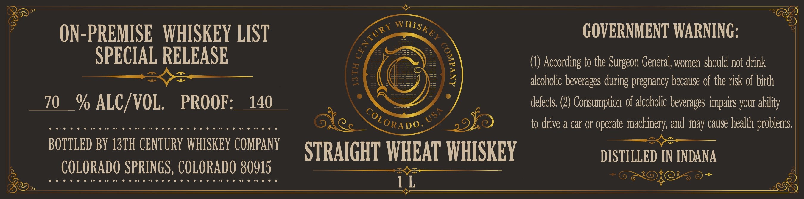

# TTB COLA Label Images - TTBID 26226001000304

**Brand Name:** 13TH CENTURY WHISKEY COMPANY

**Issue Date:** 08/24/2026

**Origin Code:** 13

**Product Class/Type:** 109

**Source:** [TTB Public COLA Registry](https://ttbonline.gov/colasonline/viewColaDetails.do?action=publicFormDisplay&ttbid=26226001000304)

## Label Images

### Label 1

## Extracted Label Text

*Text extracted via OCR - may contain errors*

**Detected Proof:** 140

### Label 1

ON-PREMISE   WHISKEY LIST
GOVERNMENT WARNING:
SPECIAL RELEASE
According to the
General; women should not drink
F
62
alcoholic beverages during pregnancy because of the risk of birth
70
% ALC/VOL.
PROOF:
140
defects: (2) Consumption 0f alcoholic beverages impairs your
to drive a car or operate
machinery; and may cause health problems
BOTTLED BY 13TH CENTURY WHISKEY COMPANy
STRAIGHT WHEAT WHISKEY
DISTILLED IN INDANA
COLORADO SPRINGS, COLORADO 80915
1L
WHISKEY
CENTURY
1
Surgeon
abiity
USA
CoLoRADO
