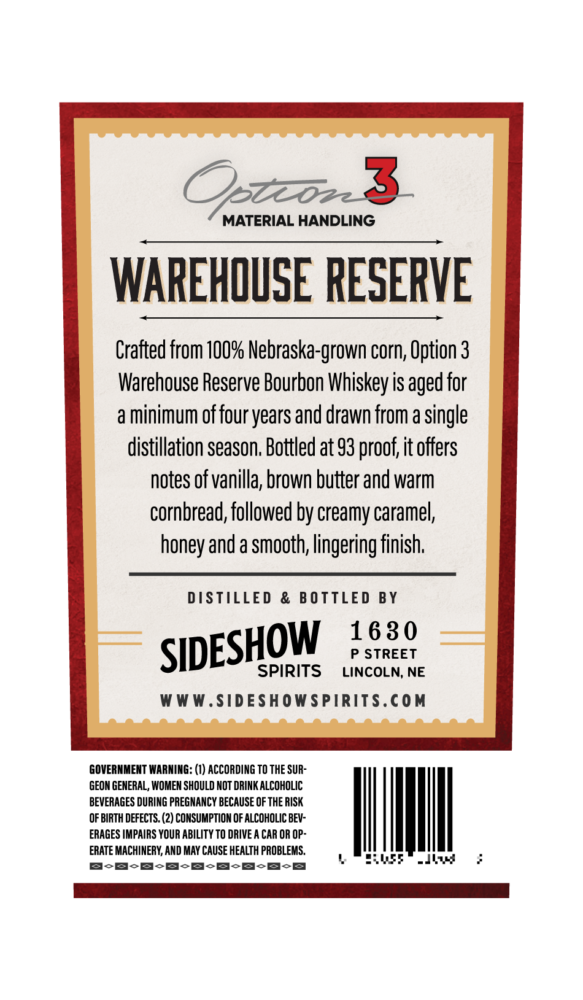
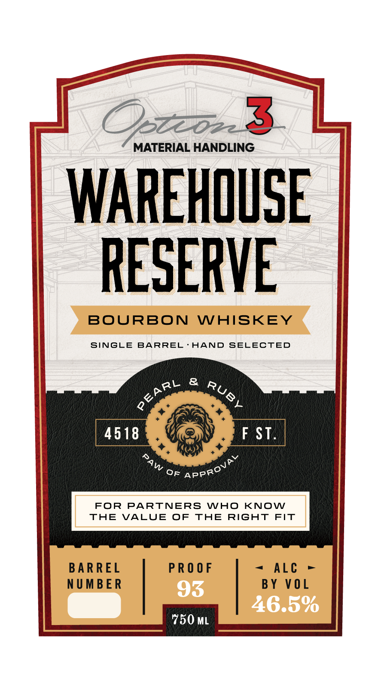

# TTB COLA Label Images - TTBID 26226001000306

**Brand Name:** OPTION 3 MATERIAL HANDLING

**Fanciful Name:** WAREHOUSE RESERVE

**Issue Date:** 09/14/2026

**Origin Code:** 31

**Product Class/Type:** 141

**Source:** [TTB Public COLA Registry](https://ttbonline.gov/colasonline/viewColaDetails.do?action=publicFormDisplay&ttbid=26226001000306)

## Label Images

### Back Label

### Front Label

## Extracted Label Text

*Text extracted via OCR - may contain errors*

**Detected Proof:** 93

### Back Label

Zoe

w

MATERIAL HANDLING

WAREHOUSE RESERVE

Crafted from 100% Nebraska-grown corn, Option 3

Warehouse Reserve Bourbon Whiskey is aged for

a minimum of four years and drawn from a single

distillation season. Bottled at 93 proof, it offers

notes of vanilla, brown butter and warm

cornbread, followed by creamy caramel,

honey and a smooth, lingering finish.

DISTILLED & BOTTLED BY

1630

SIDES

OW

P STREET

SPIRITS

LINCOLN, NE

WWW.SIDESHOWSPIRITS.COM

-

GOVERNMENT WARNING: (1) ACCORDING TO THE SUR

GEON GENERAL, WOMEN SHOULD NOT DRINK ALCOHOLIC

BEVERAGES DURING PREGNANCY BECAUSE OF THE RISK

OF BIRTH DEFECTS. (2) CONSUMPTION OF ALCOHOLIC BEV-

ERAGES IMPAIRS YOUR ABILITY TO DRIVE A CAR OR OP-

ERATE MACHINERY, AND MAY CAUSE HEALTH PROBLEMS.

:

VM

B-S-S-S-S-S-S-S-sS

DIM a ESN EN Moe SERIA |

### Front Label

Ozzzo3
MATERIAL HANDLING
WAREHOUSE
RESERVE
BOURBON
WAISKEY
SINGLE
BARREL
HAND
SELECTED
8
4518
F ST_
OF
FOR
PARTNERS
WAO
KNOW
THE
VALUE
OF
THE
RiGhT FiT
BARREL
PR O 0 F
ALc
NUMBER
93
BY V0 L
46.5%
750 ML
PEARL
RUBY
PAW
APPROVAY
