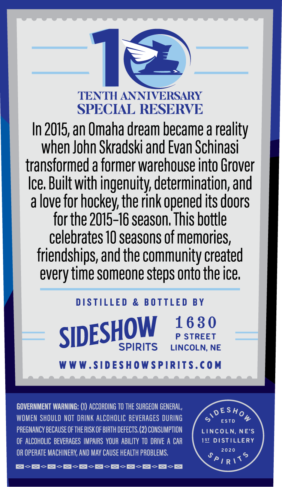
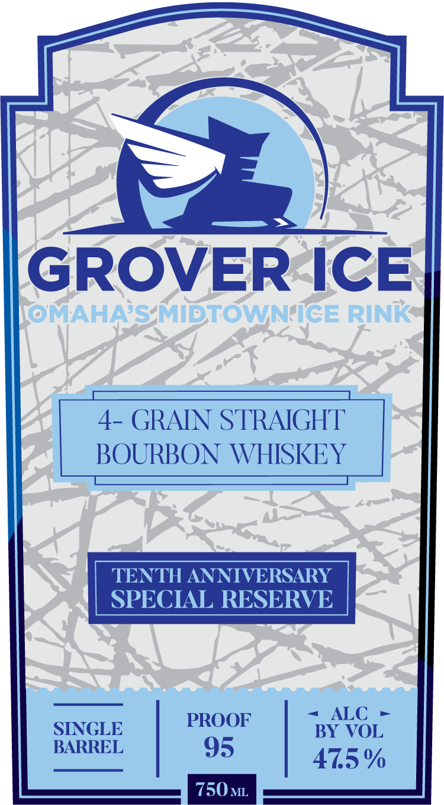

# TTB COLA Label Images - TTBID 26226001000340

**Brand Name:** GROVER ICE OMAHA'S MIDTOWN ICE RINK

**Fanciful Name:** TENTH ANNIVERSARY SPECIAL RESERVE

**Issue Date:** 08/24/2026

**Origin Code:** 31

**Product Class/Type:** 101

**Source:** [TTB Public COLA Registry](https://ttbonline.gov/colasonline/viewColaDetails.do?action=publicFormDisplay&ttbid=26226001000340)

## Label Images

### Back Label

### Front Label

## Extracted Label Text

*Text extracted via OCR - may contain errors*

**Detected Proof:** 95

### Back Label

T=

TENTH ANNIVERSARY
SPECIAL RESERVE
In 2015, an Omaha dream became a reality
when John Skradski and Evan Schinasi
transformed a former warehouse into Grover
Ice. Built with ingenuity, determination, and
a love for hockey, the rink opened its doors
for the 2015-16 season. This bottle
celebrates 10 seasons of memories,
friendships, and the community created
every time someone steps onto the ice,

DISTILLED & BOTTLED BY

SIDESHOW 182°

SPIRITS LINCOLN, NE
WWW.SIDESHOWSPIRITS.COM

GOVERNMENT WARNING: (1) ACCORDING TO THE SURGEON GENERAL, DESH
WOMEN SHOULD NOT DRINK ALCOHOLIC BEVERAGES DURING S exp %
PREGNANCY BECAUSE OF THE RISK OF BIRTH DEFECTS. (2) CONSUMPTION LINCOLN, NE'S

OF ALCOHOLIC BEVERAGES IMPAIRS YOUR ABILITY TO DRIVE A CAR 131 DISTILLERY
OR OPERATE MACHINERY, AND MAY CAUSE HEALTH PROBLEMS.
BoE -S-S-S-S-S-S-8-8-8

### Front Label

GROVER ICE
@MAHAS MIDTOWNIGE RINK
4- GRAIN STRAIGHT
BOURBON WHISKEY
TENTH ANNIVERSARY
SPECIAL RESERVE
PROOF
ALC
SINGLE
BY VOL
BARREL
95
47.5%
750ML
