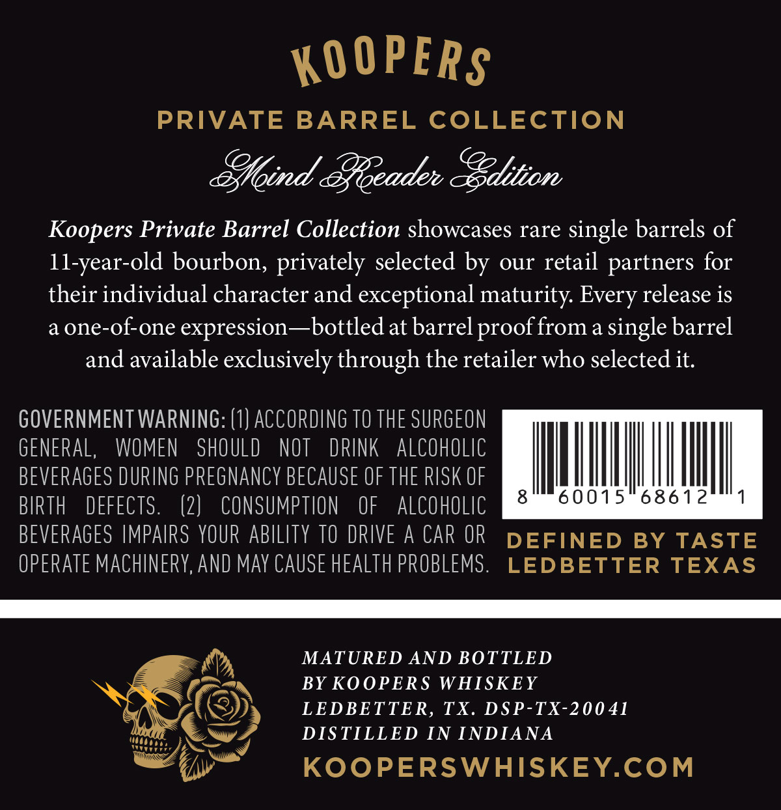
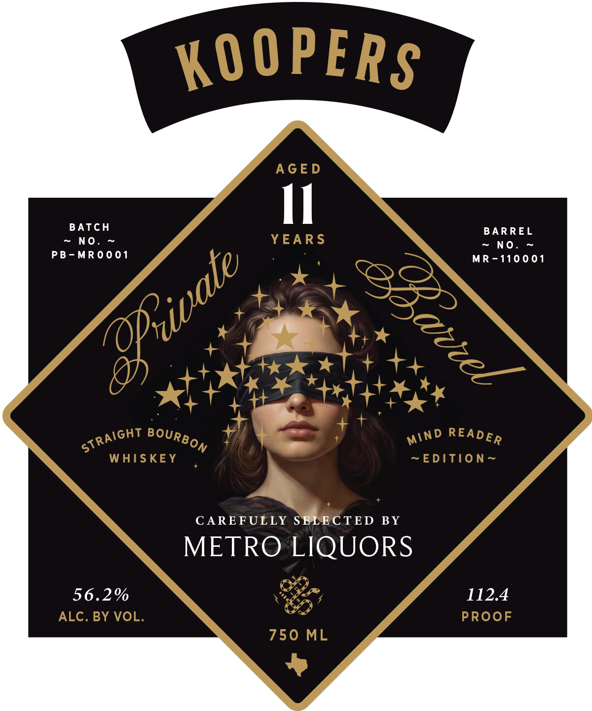

# TTB COLA Label Images - TTBID 26226001000373

**Brand Name:** KOOPERS

**Fanciful Name:** PRIVATE BARREL COLLECTION - MIND READER EDITION

**Issue Date:** 08/31/2026

**Origin Code:** 44

**Product Class/Type:** 101

**Source:** [TTB Public COLA Registry](https://ttbonline.gov/colasonline/viewColaDetails.do?action=publicFormDisplay&ttbid=26226001000373)

## Label Images

### Back Label

### Front Label

## Extracted Label Text

*Text extracted via OCR - may contain errors*

**Detected Proof:** 112.4

### Back Label

KOOPERS
PRIVATE
BARREL COLLECTION
Eoind coeade ~Gdition
Koopers Private Barrel Collection showcases rare single barrels of
II-year-old bourbon, privately selected by
our retail partners for
their individual character and exceptional maturity
release is
a one-of-one expression-~bottledat barrel
from a single barrel
and available exclusively through the retailer who selected it:
GOVERNMENT WARNING: (1) ACCORDING TO THE SURGEON
GENERAL,
WOMEN
SHOULD
NOT
DRINK
alCoholIc
BEVERAGES DURING PREGNANCY BECAUSE OF THE RISK OF
BIRTH
DEFECTS.
(2)
CONSUMPTION
OF
alCohOLic
8
60015
686 12
BEVERAGES IMPAIRS YOUR ABILITY TO DRIVE A CAR OR
DEFINED
BY
TASTE
OPERATE MACHINERY,ANd May CAUSE HEAlTh PROBLEMS .
LEDBETTER
TEXAS
MATURED AND BOTTLED
BY KOOPERS WHISKEY
LEDBETTER, TX.
DSP-TX-20041
DIS TILLED IN INDIANA
KOOPERSWHISKEY.COM
Every
proof

### Front Label

KO OPERS
AGE D
II
BATCH
BAR REL
No .
YEARS
No .
PB-MR 0 0 01
MR-1100 01
WHISKEY
~EDITION~
CAREFULLY SELECTED
BY
METRO LIQUORS
56.2%
112.4
ALC. BY VOL.
PROoF
750 ML
private
avcel
STRAiGHT
BOURBON
READER
MiND
