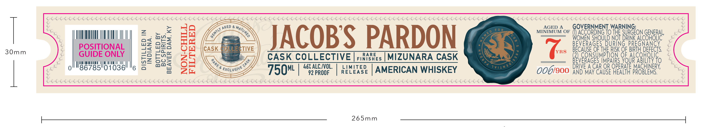
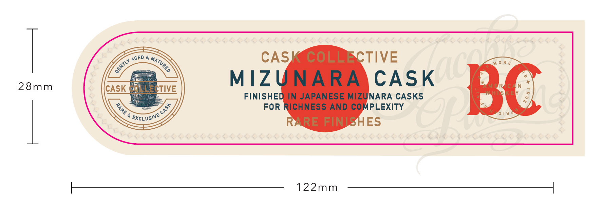

# TTB COLA Label Images - TTBID 26226001000411

**Brand Name:** JACOB'S PARDON MIZURANA CASK

**Issue Date:** 08/24/2026

**Origin Code:** 22

**Product Class/Type:** 140

**Source:** [TTB Public COLA Registry](https://ttbonline.gov/colasonline/viewColaDetails.do?action=publicFormDisplay&ttbid=26226001000411)

## Label Images

### Label 1

### Label 2

## Extracted Label Text

*Text extracted via OCR - may contain errors*

**Detected Proof:** 92

### Label 1

SRNR RNR SRNR RRR RSS,

<

i tas Ya es Wn Ys es en Va Ye To en Tea Yn ts ea a Un Ute Tes an Yaa Tae Ts Te etn es a Ya Un Tete Ten a Ya fa es a tn Ye fea Un aa Ye tn en Ya Can fn Ua Van an

s Yaa San Va Ya Un Ton iin Ya Ua Se cia Va Us Cain Ua Uae Vi ta Tea Ya Ye fan ln Un tn aia a Van Ta Tan an Ua Yan Ua a Ut Tat

GOVERNMENT WARNI

—

i=

Ha

KE

AGED & My Pups

{AMUN AHA I

es

aws

<

MINIMUM OF (1) ACCORDING 10 THE SURGEON GENERAL,

U

T DRINK aniWate

)

Ort

me

i

30mm

POSITIONAL

a=

4%

0.47

w=o

On

CASK

TIVE

JACOBS PARDON

RS BECAUSE OF THE RISK OF nie DERECTS

GUIDE ONLY

=)

Zz

Fu

CASK COLLECTIVE |;

NISHES

RARE

|MIZUNARA CASK

6

|

Al

Ill

ty Uy Ta

I

Ha il

I

moat

oO

%e

VERAGES IMPAIRS YOUR ABILITY TO

d

86785

01036

6 ha

ZA

© Reus

% ALC./VOL

RELEASE

LIMITED

006/900

AND MAY CAUSE HEALTH PROBLEMS. -

DRIVE A CAR OR OP.

|

—

FBO" |"

92 PROOF

| AMERICAN WHISKEY

BRR SERS ERE NSIS ER BRR RRR RRR RRR RRR REN SRR RRR RNB RNR ERR RR SNES RRR RNR RN RRR RRR RRR R RRR ER? SRR RRR RRR RRR R RS

Gon Vee ee Ve as Vie Va Yee es Vie Ve Vee ln Uae Uae Ue Ye Yaa Tae Te Tes Va Ua Tan ts cn Yaa Tan Tn fea tos Ya tan a as

265mm

### Label 2

CASK COLLECTIVE
28mm
CASK  TLEEcTIVE
MIZUNARA
CASK
BC
FINISHED IN JAPANESE MIZUNARA CASKS
FOR RICHNESS AND COMPLEXITY
ExcLusive
RARE FINISHES
122mm
AGED
MATURED
GENTLY_
3
1
