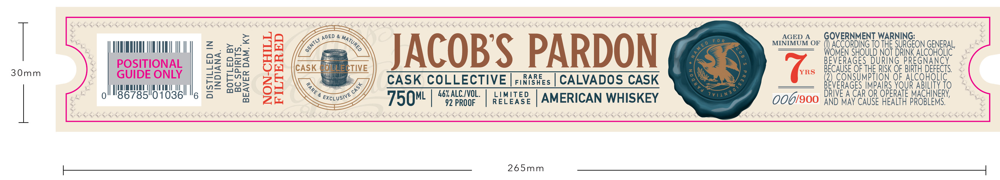
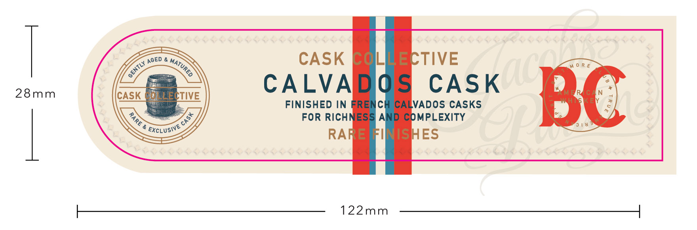

# TTB COLA Label Images - TTBID 26226001000420

**Brand Name:** JACOB'S PARDON CALVADOS CASK

**Issue Date:** 08/25/2026

**Origin Code:** 22

**Product Class/Type:** 140

**Source:** [TTB Public COLA Registry](https://ttbonline.gov/colasonline/viewColaDetails.do?action=publicFormDisplay&ttbid=26226001000420)

## Label Images

### Front Label

### Label 2

## Extracted Label Text

*Text extracted via OCR - may contain errors*

**Detected Proof:** 92

### Front Label

= Vals Yaa Van Ca Tae Con Vn Tata Cl Tn a Ua ain ci in la a ln a aa en aa Van an Can in as a a aa Ya an a a

iva Yaa ttn ta a os in tn Yn a ein a tain a en ln Van as Can a Vas Yan a een Van ats ea Vln ln Ua as Can Uta Ya Tain a a Ya ta a aa aa Ua os an a a fan an aa a na

sain ‘a Vl lia a Cn ll iia in Vn tn ta aia a a “a itn in dn (a a a a Yt a a “te a a a a A a a a a

=

Ha

os

GOVERNMENT WARNING:

p

MUTUAL a

oMWs

>

DED & yg »

MINIMUM OF ()) ACCORDING IO THE SURGEON GENERAL,

T DRINK aa

wz

mio

ara

fo

30mm

POSITIONAL

a=

oz

Jon

Of

JACOBS PARDON

ns BECAUSE OF THE RISK OF BIRTH DERECTS

GUIDE ONLY

—2)

Wii

NISHES

RARE

6

]

lll

UU a

|

LAT AT

|

mat

oo

ee

&

CASK COLLECTIVE |r:

| CALVADOS CASK

Ke

ERAGES IMPAIRS YOUR au 10

86785

01036

AES

% ALC./VOL

RELEASE

LIMITED

006/900

DRIVE A CAR OR OPE

NN exeLus®

750" | “

92 PROOF

| AMERICAN WHISKEY

AND MAY CAUSE HEALTH PROBLEMS.

saa Vas Yaa Van Ve Ta Cala en a ale Yaa an a Ve le Tae a Ve Ya Yaa a Vn Yan fan a Can Va ln Ta an Van Ta fan an a a a a

BRE NP SPR RARER ENE RER RNR RARER RENE APR NERNEY AERP AE NPR SPR RR APRP RE RERE NPRE A R SRPRAPRES,

Vas Yaa a Va Va Yala Yaa Yan Ca Yala Uae a as aa Yt a

i tai ae Yaa tan as an a a?

s Yan ae tae Yan an aa a an

265mm

### Label 2

CASK Cq
ECTIVE
28mm
CALVADOS
CASK
CASK LECTIVE
FINISHED IN FRENC
CALVADOS CASKS
BC
FOR RIcHNESS ANI
COMPLEXITY
ExcLusive
RARE FINNISHES
122mm
AGED
MATURED
GENTLY _
1
3
