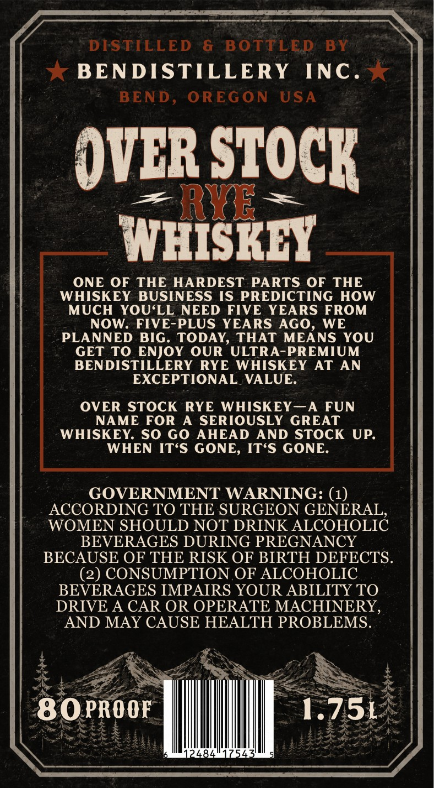
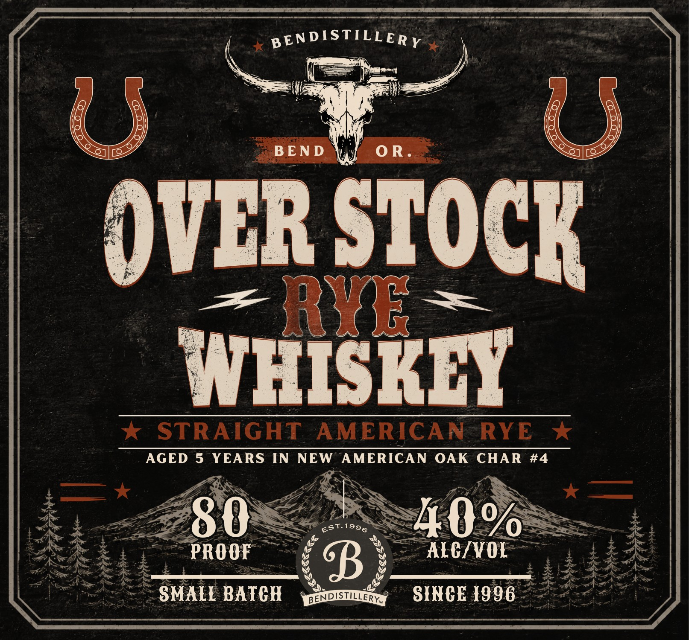

# TTB COLA Label Images - TTBID 26226001000531

**Brand Name:** OVER STOCK

**Issue Date:** 08/25/2026

**Origin Code:** 38

**Product Class/Type:** 102

**Source:** [TTB Public COLA Registry](https://ttbonline.gov/colasonline/viewColaDetails.do?action=publicFormDisplay&ttbid=26226001000531)

## Label Images

### Back Label

### Front Label

## Extracted Label Text

*Text extracted via OCR - may contain errors*

**Detected Proof:** 80
**Detected Age:** 5 Years

### Back Label

DISTILLED
6
BOTTLED
BY
BENDISTILLERY
INC .
BEND ,
OREG ON
USA
OVCR STOCK
3
RYE
WHISKEY
ONE OF
THE HARDEST PARTS OF
THE
WHISKEY BUSINESS IS PREDICTING
HOW
MUCH YOU LL NEED FIVE YEARS FROM
NOW:
FIVE-PLUS YEARS AGO
WE
PLANNED
BIG. TODAY,
THAT MEANS YOU
GET TO ENJOY OUR
ULTRA-PREMIUM
BENDISTILLERY RYE
WHISKEY
AT AN
EXCEPTIONAL VALUE:
OVER STOCK
RYE WHISKEY A
FUN
NAME FOR
A SERIOUSLY GREAT
WHISKEY: SO GO AHEAD
AND STOCK UP:
WHEN
ITsS GONE, ITsS GONE:
GOVERNMENT WARNING: (1)
ACCORDING TO THE SURGEON GENERAL
WOMEN SHOULD NOT DRINK ALCOHOLIC
BEVERAGES DURING PREGNANCY
BECAUSE OF THE RISK OF BIRTH DEFECTS:
(2) CONSUMPTION OF ALCOHOLIC
BEVERAGES IMPAIRS YOUR ABILITY TO
DRIVE A CAR OR OPERATE MACHINERY,
AND MAY CAUSE HEALTH PROBLEMS.
80PROOF
1.751
2484
754

### Front Label

mantic gage

nina

pENDISTILLERy

mee

=

i:

~~

i

)VER sToc

WHISKEY

* STRAIGHT * STRAIGHT AMERICAN-RYE x RYE *

AGED 5 YEARS IN NEW ‘AMERICAN OAK CHAR #4

fer

i——

oy

Lis

aN

oe EE

WO OR

Re

FE

rs

=

ee

Se EST 1996

Ade

Ree

Nie Ae Et

pe

PROOF

MeV

Nae

g

>

~ SMALL BATCH

SINCE 1906”

li

Aw

AiacSEES ASE AS ES ee eS

Ea ee ait

pipe
