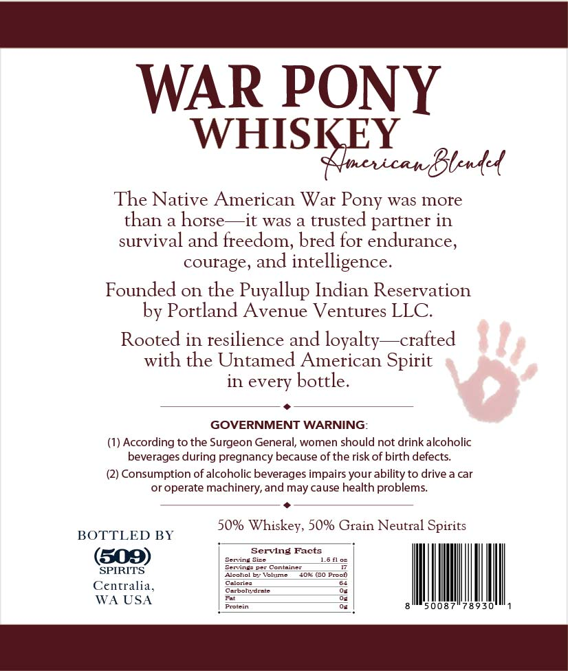
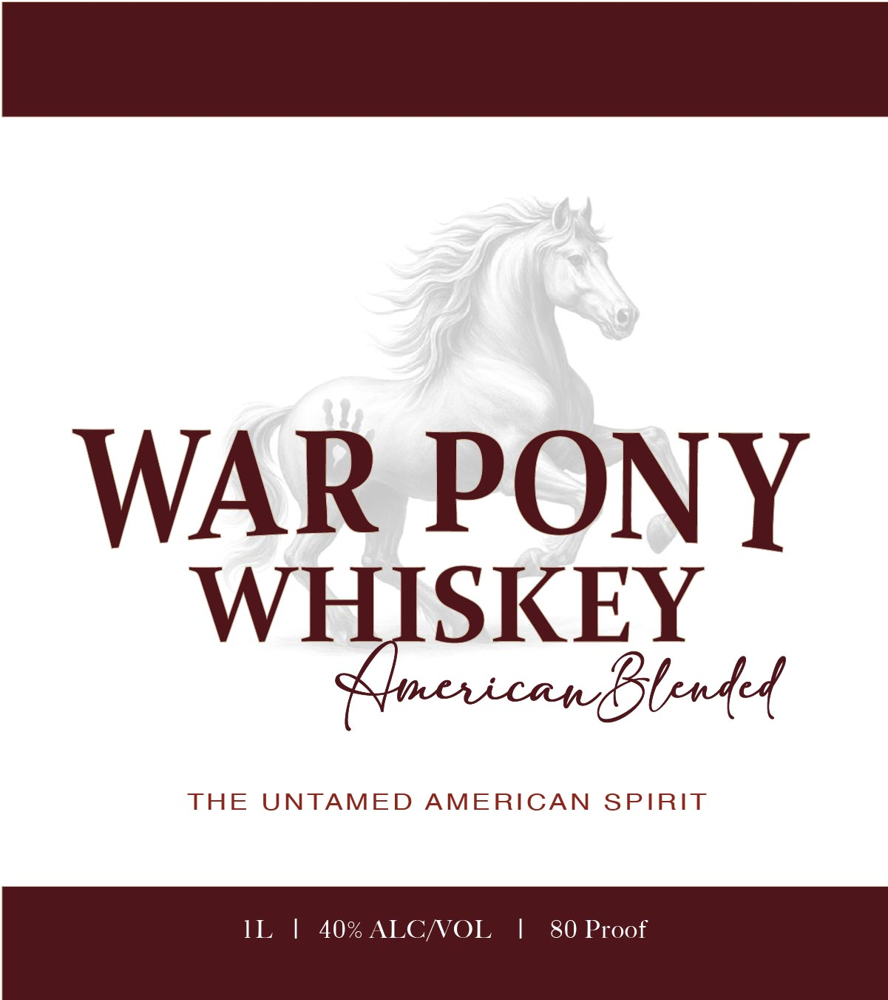

# TTB COLA Label Images - TTBID 26226001000662

**Brand Name:** WAR PONY WELL WHISKEY AMERICAN BLENDED

**Fanciful Name:** WHISKEY AMERICAN BLENDED

**Issue Date:** 09/18/2026

**Origin Code:** 07

**Product Class/Type:** 140

**Source:** [TTB Public COLA Registry](https://ttbonline.gov/colasonline/viewColaDetails.do?action=publicFormDisplay&ttbid=26226001000662)

## Label Images

### Back Label

### Front Label

## Extracted Label Text

*Text extracted via OCR - may contain errors*

**Detected Proof:** 80

### Back Label

WAR PONY
WHISKEY
KcicanBtnk4
The Native American War Pony was more
than
horse
it was
trusted partner in
survival and freedom; bred for endurance,
courage, and
intelligence.
Founded on the Puyallup Indian Reservation
by Portland Avenue Ventures LLC.
Rooted in resilience and loyalty
crafted
with the Untamed American Spirit
in every bottle.
GOVERNMENT WARNING:
(1) According to the Surgeon General, women should not drink alcoholic
beverages during pregnancy because of the risk of birth defects:
(2) Consumption of alcoholic beverages impairs your ability to drive a car
or operate machinery,and may cause health problems
50% Whiskey, 50% Grain Neutral Spirits
BOTTLED BY
Servlng Facts
(509)
Seriine Sie
Serringz per
Container
SPIRITS
Alcohol b Volume
40 (30 Procf)
Oolorie
Centralia
Oagoctiten
WA USA
Prorcin
008
8 930'

### Front Label

WAR PONY
WHISKEY
AhcxicanBstnk{
THE
UNTAMED
AMERICAN
SPIRIT
IL
40% ALCNOL
1
80 Proof
