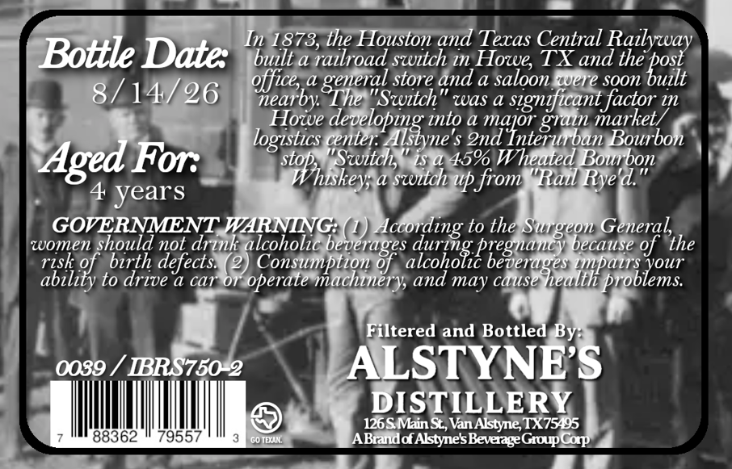
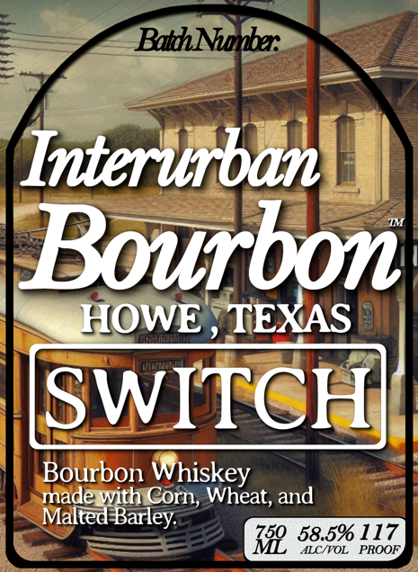

# TTB COLA Label Images - TTBID 26226001000667

**Brand Name:** INTERURBAN BOURBON

**Fanciful Name:** HOWE TEXAS "SWITCH"

**Issue Date:** 08/28/2026

**Origin Code:** 44

**Product Class/Type:** 141

**Source:** [TTB Public COLA Registry](https://ttbonline.gov/colasonline/viewColaDetails.do?action=publicFormDisplay&ttbid=26226001000667)

## Label Images

### Back Label

### Front Label

### Label 2

## Extracted Label Text

*Text extracted via OCR - may contain errors*

*1 image(s) excluded: text did not meet readability threshold*

**Detected Age:** 4 Years

### Back Label

In 1873, the Houston and Texas Central Railyway
Bottle Date:
bult a railroad switch in Howes TX and the
'bostt
store and a saloon "ere soon
8/14/26
%lea6"
The "Switch
was a
signficant factor
1n
Howe
daulopaiymia
into a
nadloiegrbumGoketb
logistics center
2nd
Bourbon
Aged For:
'5i9 hukeoid ,
iS 4 45% Wheated Bourbon
a switch up from
'Rail Rye &."
4
years
GOVERNMENT WARNING:
According to the Surgeon General
women should not drink alcoholic beverages
because of  the
risk of
birth defects:
pease macuery,6
3ZZ4R
ability to drive a car
Or
operate
and may cause
Filtered and Bottled By:
0039
RRS750 2
ALSTYNFS
DISTILLERY
126S. Main S, Van Alstyne; TX75495
88362
79557
Go IEuAK
ABradd AstyneSBeverage
Cop
general
Group

### Front Label

BathNuber:
Interurban
Bourbon
HOWE
TEXAS
SWITCH
Bourbon Whiskey
made with Corn; Wheat, and
Malted Barley:
Tiz 58.5% JROJF
ALC{VOL
PROOF
