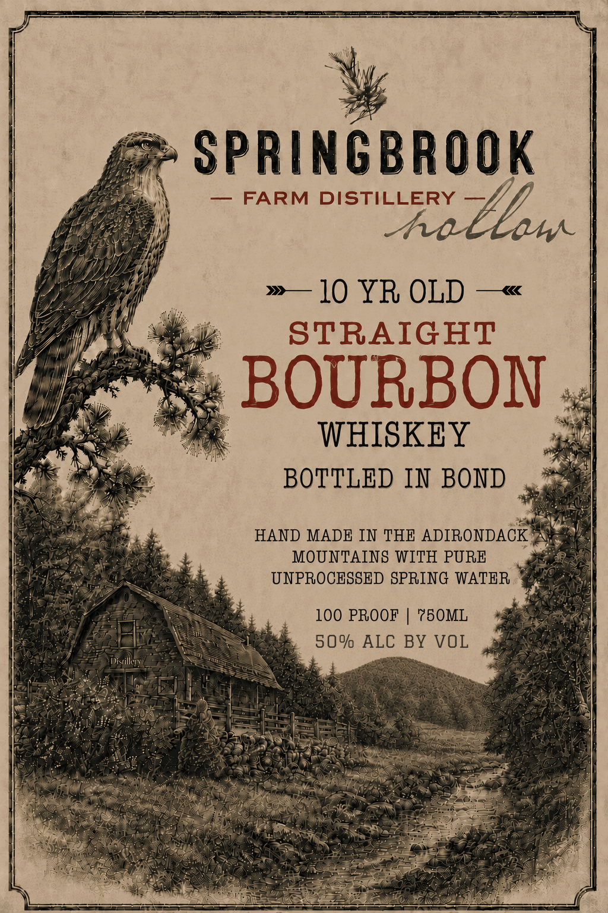
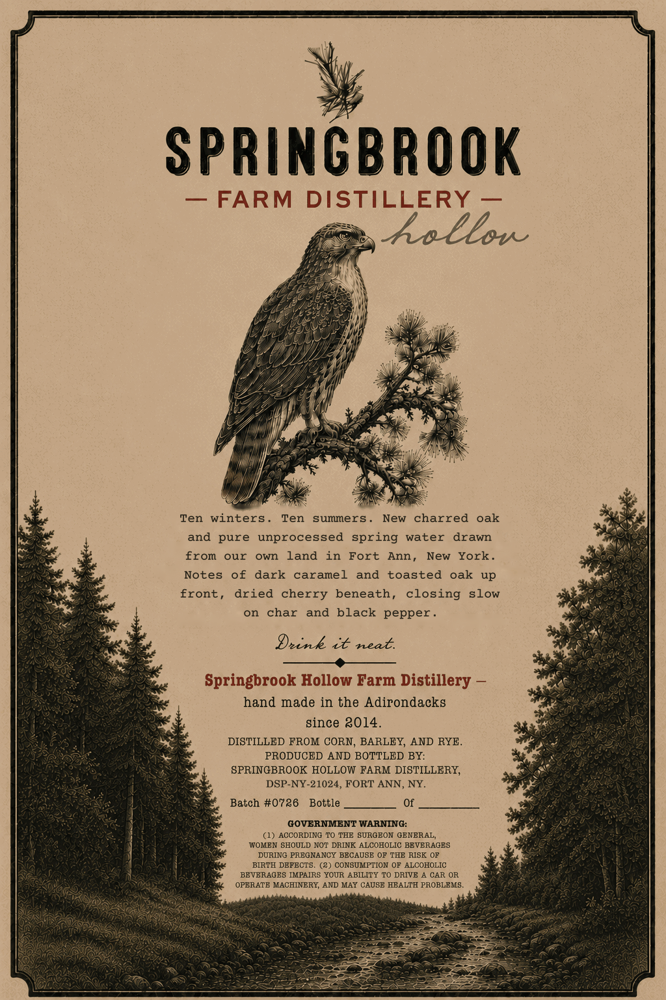

# TTB COLA Label Images - TTBID 26227001000053

**Brand Name:** SPRINGBROOK HOLLOW FARM DISTILLERY
10 YR OLD STRAIGHT BOURBON
BOTTLED IN BOND

**Issue Date:** 08/31/2026

**Origin Code:** 02

**Product Class/Type:** 111

**Source:** [TTB Public COLA Registry](https://ttbonline.gov/colasonline/viewColaDetails.do?action=publicFormDisplay&ttbid=26227001000053)

## Label Images

### Label 1

### Label 2

## Extracted Label Text

*Text extracted via OCR - may contain errors*

**Detected Proof:** 100
**Detected Age:** 10 Years

### Label 1

ee es ee
| : i |
| > SPRINGBROOK
es Sidi 7
oi. \ — FARM DISTILLERY Y/,
Operas '
Phere Me
ME! iff, if
Lh He | »— 10 YR OLD —«
oe) rn
RS iy STRAIGHT
fff! PR SY As Z
f nit aye se, Ky a B O RB O |
>) pil ae Re nt,
| Or aS 7
ie Ae ii. ON “SniaA
) os WHISKEY pr
We Ne hee
ee ee BOTTLED IN BOND ,
ONS eine se
or aie a HAND MADE IN THE ADIRONDACK “kai
bee Oe a MOUNTAINS WITH PURE  gifgems
PPS ae RL | OS UNPROCESSED SPRING WATER "gaa
Peo ee «100 PROOF | 750ML gages
Pe ere Ree 50% ALC BY VOL
t DE willy eos SN eas oe SEPA eT
a NOE A opie) ey Pina eT ORES
Bree Spe ee ee ad F PSS een eas NE
ae ah eee hier = =F J OR ee 2% x
as anh ON 2H IBS | eT et ae eel es I a i A ED ( ; |)
Pe Sole 5 1S AoE RGD en eager a
(Y TOM Gare PEL hg ROS ye AO ei SO Oe ets Tari ‘s
ONS SS TRA IRR eo eas le re Sa il SAR <r eat me
\"\ : heist is Pees eee Oe:

### Label 2

SPRINGBROOk
FARM
DISTILLERY
hellon
Ten
winters
Ten
summers
New
charred
oak
and pure unprocessed
spring water
drawn
from
our
own
land
in
Fort
Ann
New
York
Notes
of
dark
caramel
and
toasted
oak
up
front ,
dried cherry
beneath, closing
slow
on
char
and black pepper .
Drink it neat
Springbrook Hollow Farm Distillery
hand made in the Adirondacks
since 2014_
DISTILLED FROM CORN, BARLEY, AND RYE
PRODUCED AND BOTTLED BY:
SPRINGBROOK HOLLOW FARM DISTILLERY,
DSP-NY-21024, FORT ANN, NY.
Batch #0726
Bottle
GOVERNMENT WARNING:
ACCORDING TO THE SUROEON GBNERAL,
WOMEN SHOULD NOT DRINK ALCOHOLIC BEVERAGES
DURING PREGNANCY BBCAUSE OP THB RISK OF
BIRTH DBPBCTB.
(2) CONSUMPTION OF ALCOHOLIC
BBVERAGES IMPAIRS YOUR ABILITY TO DRIVE
CAR OR
OPERATE MACHINBRY, AND MAY CAUSE HEALTH PROBLEMS .
