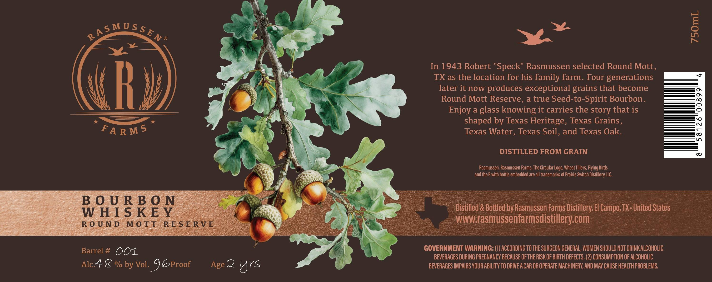

# TTB COLA Label Images - TTBID 26227001000059

**Brand Name:** ROUND MOTT RESERVE

**Issue Date:** 09/03/2026

**Origin Code:** 44

**Product Class/Type:** 141

**Source:** [TTB Public COLA Registry](https://ttbonline.gov/colasonline/viewColaDetails.do?action=publicFormDisplay&ttbid=26227001000059)

## Label Images

### Label 1

### Label 2

## Extracted Label Text

*Text extracted via OCR - may contain errors*

*1 image(s) excluded: text did not meet readability threshold*

### Label 1

y

~~

a

Ww

) ae

In 1943 Robert "Speck" Rasmussen selected Round Mott

TX as the location for his family farm. Four generations

later it now produces exceptional grains that become

a?

Round Mott Reserve, a true Seed-to-Spirit Bourbon

ie

Enjoy a glass knowing it carries the story that is

shaped by Texas Heritage, Texas Grains

ees

rt

Texas Water, Texas Soil, and Texas Oak

DISTILLED FROM GRAIN

=~

CH,

x

—,

Rasmussen, Rasmussen Farms, The Circular Logo, Wheat Tillers, Flying Birds

Oe

and the R with bottle embedded are all trademarks of Prairie Switch Distillery LLC.

Ks

a

ae

BOURBON

Be

ag

mt

ed by Rasmusse

TX- United States

WHISKEY

ROUND MOTT RESERVE

*

eae

rms

distillery.com:

ea

Sit

Ww

‘|

GOVERNMENT WARNING: (1) ACCORDING TO THE SURGEON GENERAL, WOMEN SHOULD NOT DRINK ALCOHOLIC

Barrel # OO.

BEVERAGES DURING PREGNANCY BECAUSE OF THE RISK OF BIRTH DEFECTS. (2) CONSUMPTION OF ALCOHOLIC

Alc+ & % by Vol 5 ©Proof

Age 22 Yu VS

BEVERAGES IMPAIRS YOUR ABILITY TO DRIVE ACAR OR OPERATE MACHINERY, AND MAY CAUSE HEALTH PROBLEMS.
