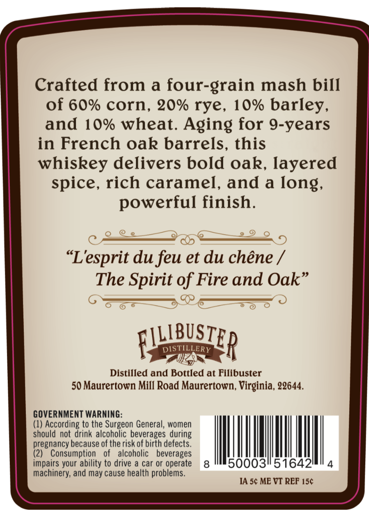
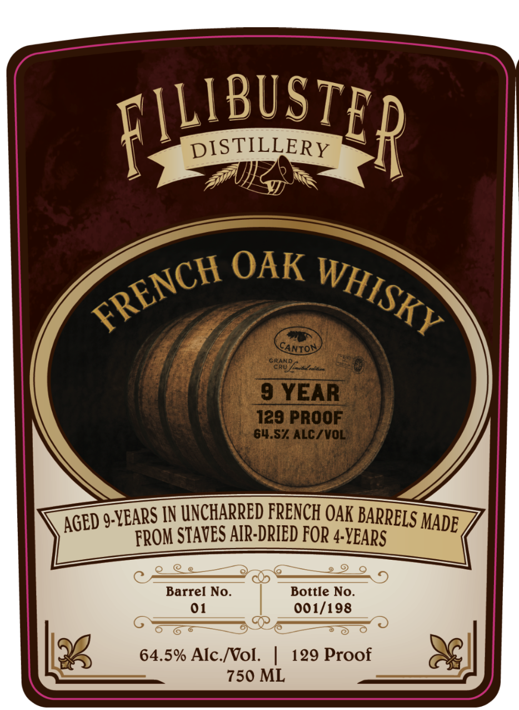

# TTB COLA Label Images - TTBID 26227001000061

**Brand Name:** FILIBUSTER

**Issue Date:** 09/01/2026

**Origin Code:** 05

**Product Class/Type:** 140

**Source:** [TTB Public COLA Registry](https://ttbonline.gov/colasonline/viewColaDetails.do?action=publicFormDisplay&ttbid=26227001000061)

## Label Images

### Back Label

### Front Label

## Extracted Label Text

*Text extracted via OCR - may contain errors*

**Detected Proof:** 129
**Detected Age:** 9 Years

### Back Label

Crafted from
a
four-grain mash bill
of 60% corn, 20% rye, 10% barley,
and 10% wheat. Aging for 9-years
in French oak barrels, this
whiskey delivers bold oak, layered
spice, rich caramel, and a Iong;
powerful finish:
"Lesprit dufeu et du chene
The Spirit of Fire and Oak"
LLIBUSTE
DISTILLERY
p
Distilled and Bottled at Filibuster
50 Maurertown Mill Road Maurertown, Virginia, 22644.
GOVERNMENT WARNING:
(1) According to the Surgeon General, women
should not drink alcoholic beverages during
pregnancy because of the risk of birth defects.
(2)
Consumption
of
alcoholic
beverages
impairs your ability to drive a car or operate
8
500031516421
machinery; and may cause health problems_
IA 5c ME VT REF 15c

### Front Label

FLUBUSTER
DISTILLERY
OAK
CANTON
GRAND
CRUA aeiaa
9 YEAR
129 PROOF
64.S7 ALC/ VOL
) 9-YEARS IN UNCHARRED FRENCH OAK BARRELS >
FROM STAVES AIR-DRIED FOR 4-YEARS
Barrel No_
Bottle No.
01
001/198
64.5% Alc Nol.
129 Proof
750 ML
FRENCH
WHISKY
MADE
AGED
