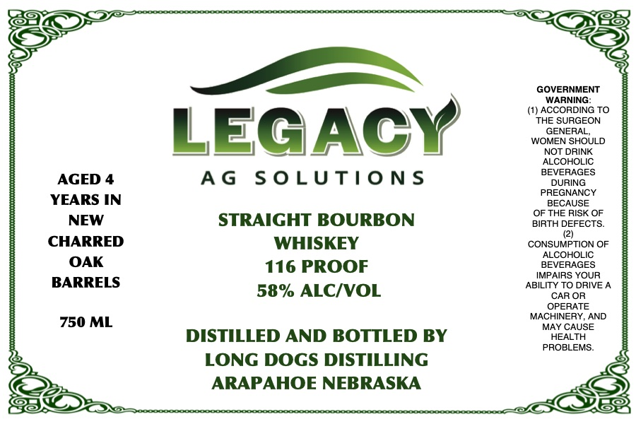

# TTB COLA Label Images - TTBID 26227001000068

**Brand Name:** LONG DOGS DISTILLING

**Fanciful Name:** LEGACY AG SOLUTIONS

**Issue Date:** 08/26/2026

**Origin Code:** 31

**Product Class/Type:** 101

**Source:** [TTB Public COLA Registry](https://ttbonline.gov/colasonline/viewColaDetails.do?action=publicFormDisplay&ttbid=26227001000068)

## Label Images

### Label 1

## Extracted Label Text

*Text extracted via OCR - may contain errors*

**Detected Proof:** 116

### Label 1

GOVERNMENT
WARNING:
(1) ACCORDING TO
THE SURGEON
LEGACY
WOGENEFHOULD
NOT DRINK
ALCOHOLIC
BEVERAGES
AGED 4
A G
S 0 LUTiO NS
DURING
PREGNANCY
YEARS IN
BECAUSE
OF THE RISK OF
NEW
STRAIGHT BOURBON
BIRTH DEFECTS_
CHARRED
WHISKEY
CONSUMPTION OF
ALCOHOLIC
OAK
116 PROOF
BEVERAGES
IMPAIRS YOUR
BARRELS
ABILITY TO DRIVE
58% ALCIVOL
CAR OR
OPERATE
MACHINERY; AND
750 ML
MAY CAUSE
DISTILLED AND BOTTLED BY
HEALTH
PROBLEMS:
LONG DOGS DISTILLING
ARAPAHOE NEBRASKA
