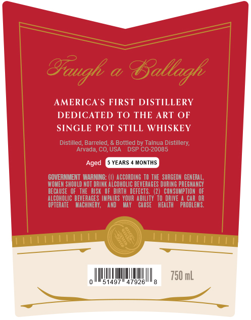
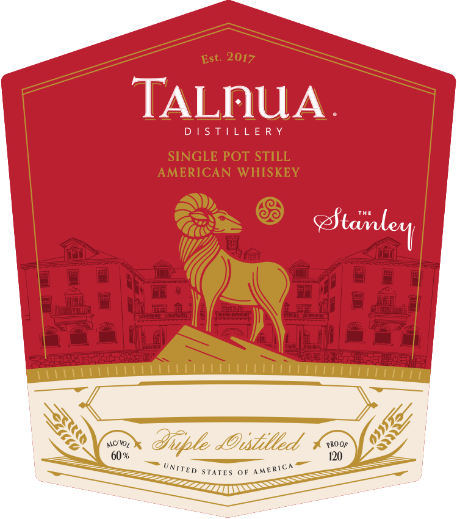

# TTB COLA Label Images - TTBID 26227001000087

**Brand Name:** TALNUA DISTILLERY

**Issue Date:** 09/22/2026

**Origin Code:** 13

**Product Class/Type:** 140

**Source:** [TTB Public COLA Registry](https://ttbonline.gov/colasonline/viewColaDetails.do?action=publicFormDisplay&ttbid=26227001000087)

## Label Images

### Back Label

### Front Label

### Label 2

### Label 3

## Extracted Label Text

*Text extracted via OCR - may contain errors*

*1 image(s) excluded: text did not meet readability threshold*

**Detected Proof:** 120

### Back Label

Gaugh =
Tallagh
AMERICA'S FIRST DISTILLERY
DEDICATED T0 THE ART OF
SINGLE POT STILL WHISKEY
Distilled; Barreled
Bottled by Talnua Distillery;
Arvada, CO, USA
DSP CO-20085
Aged
YEARS
MONTHS
COVERNMEHT WARNING: (0) ACCORDING TO THE   SURGEON  GEMERAL;
WOMEN SHOULD NOT DRINK AlCoholIc BEVERAGES DURING PREGHANCY
BECAUSE   OF   THE   RISk
BIRTH   DEFECTS,  (2)   CONSUMPTION
ALCOHOLIC BEVERAGE S  IMPAIRS   YOUR AbILITY  T0 DRIVE
ProbEebr
OPTERATE
MACHINERY,
and
May
CAUSE
hEaLTH
750 mL
497
47926

### Front Label

2017
TALnUA
D |S T|LLE R Y
SINGLE POT STILL
AMERICAN WHISKEY
ALC WOt
dOustilled
PROOF
60 %
120
STATE S
Est.
Stavle l
Ofuple
UNITED
AMERICA

### Label 2

Vitltt li

LILLALLILL ALLA LI ULLAL ALLL LAA LLL LALLA LEAL

WEL

Cc

LILLLLLLLLLLL LALLA LLL ILLIA ALLA LALA

AMERICAN SINGLE POT STILL WHISKEY

=

CSOs e eee ea hatatateetetatatatateetatatatatatetetatatetetetetatatatetetetetatteteetens

KSI KKK IKK KKK KK KIS
