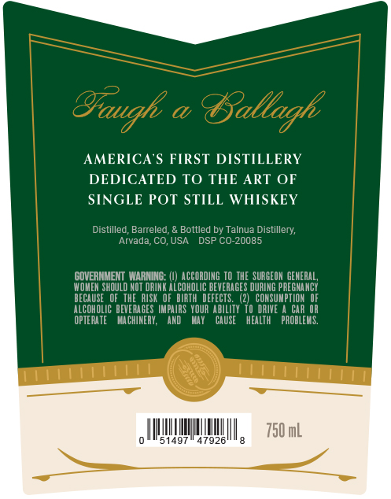
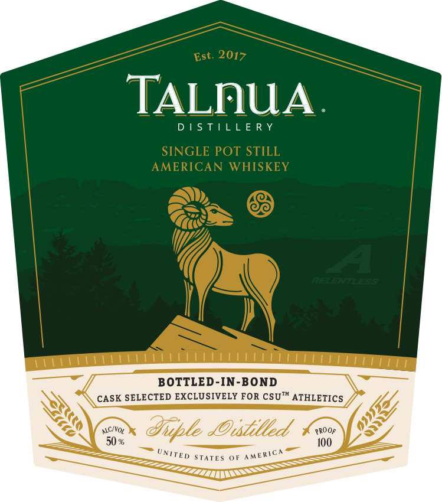
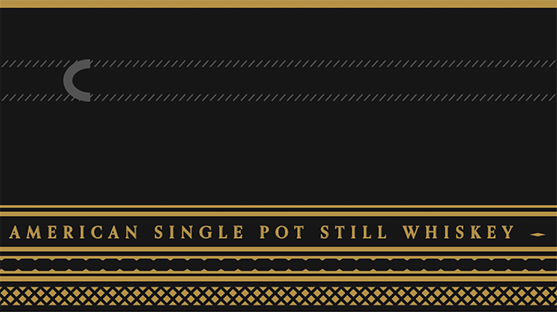

# TTB COLA Label Images - TTBID 26227001000089

**Brand Name:** TALNUA DISTILLERY

**Issue Date:** 08/26/2026

**Origin Code:** 13

**Product Class/Type:** 119

**Source:** [TTB Public COLA Registry](https://ttbonline.gov/colasonline/viewColaDetails.do?action=publicFormDisplay&ttbid=26227001000089)

## Label Images

### Back Label

### Front Label

### Label 3

### Label 4

## Extracted Label Text

*Text extracted via OCR - may contain errors*

*1 image(s) excluded: text did not meet readability threshold*

**Detected Proof:** 100

### Back Label

Baugk =
@
Tallagh
AMERICA S FIRST DISTILLERY
DEDICATED TO THE ART OF
SINGLE POT STILL WHISKEY
Distilled; Barreled
Bottled by Talnua Distillery;
Arvada; CO, USA
DSP CO-20085
GOVERNMENT WARNING:
ACCORDING TO THE SURGEON GENERAL,
WOMEN SHOULD NOT DRINK ALCohOLIC BEVERAGES DURING PREGHANCY
BECAUSE   OF   THE RISK   OF BIRTH  DEFECTS .
{2)   CONSUMPTION OF
ALCOHOLIC   BEVERAGES  IMPAIRS   YOUR AbILITY T0 DRIVE
CAR OR
OPTERATE
MACHINERY;
anD
KaT
CAUSE
hEALTH
PROBLEMS,
750 mL
51497
47926'

### Front Label

Est. 2017
TALnUA
D | S T|LL E R Y
SINGLE POT STILL
AMERICAN
WHISKEY
A
5
BOTTLED-IN-BOND
CASK SELECTED EXCLUSIVELY FOR CSUTK ATHLETICS
ALC/VOt
@uple _Oustilled
PROOF
50 %
10O
STATES
0F
UNITED
AMERICA

### Label 3

Vitltt li

LILLALLILL ALLA LI ULLAL ALLL LAA LLL LALLA LEAL

WEL

Cc

LILLLLLLLLLLL LALLA LLL ILLIA ALLA LALA

AMERICAN SINGLE POT STILL WHISKEY

=

CSOs e eee ea hatatateetetatatatateetatatatatatetetatatetetetetatatatetetetetatteteetens

KSI KKK IKK KKK KK KIS
