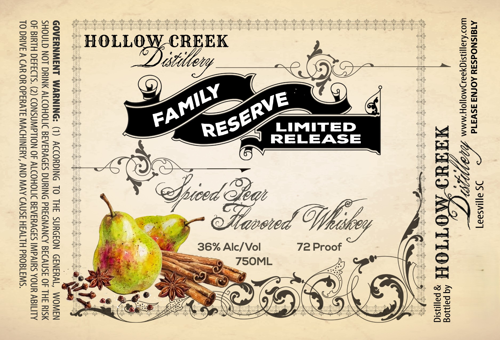

# TTB COLA Label Images - TTBID 26228001000015

**Brand Name:** HOLLOW CREEK DISTILLERY FAMILY RESERVE LIMITED RELEASE

**Issue Date:** 08/24/2026

**Origin Code:** 41

**Product Class/Type:** 149

**Source:** [TTB Public COLA Registry](https://ttbonline.gov/colasonline/viewColaDetails.do?action=publicFormDisplay&ttbid=26228001000015)

## Label Images

### Label 1

## Extracted Label Text

*Text extracted via OCR - may contain errors*

### Label 1

DS eI[!AS9e]
AISISNOdS3¥ AOLNA ASW3I1d
W09°A19]]1S1G422)MO][OH MMM V7,

4 WATT MOTION “zn

GOVERNMENT WARNING: (1) ACCORDING TO THE SURGEON GENERAL, WOMEN
SHOULD NOT DRINK ALCOHOLIC BEVERAGES DURING PREGNANCY BECAUSE OF THE RISK
OF BIRTH DEFECTS. (2) CONSUMPTION OF ALCOHOLIC BEVERAGES IMPAIRS YOUR ABILITY
TO DRIVE A CAR OR OPERATE MACHINERY, AND MAY CAUSE HEALTH PROBLEMS.
