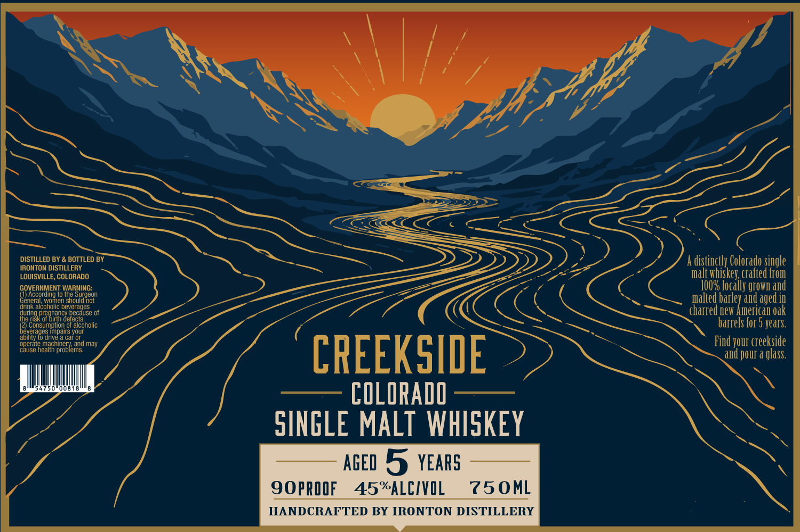

# TTB COLA Label Images - TTBID 26228001000040

**Brand Name:** CREEKSIDE

**Fanciful Name:** COLORADO SINGLE MALT WHISKEY

**Issue Date:** 08/25/2026

**Origin Code:** 13

**Product Class/Type:** 118

**Source:** [TTB Public COLA Registry](https://ttbonline.gov/colasonline/viewColaDetails.do?action=publicFormDisplay&ttbid=26228001000040)

## Label Images

### Label 1

## Extracted Label Text

*Text extracted via OCR - may contain errors*

**Detected Proof:** 90
**Detected Age:** 5 Years

### Label 1

DISTILLED BY & BOTTLED BY
distinclly Colorado single
IRONTON DISTILLERY
LOUISVILLE, COLORADO
malt
crafted Ftom
GOVEROrdIFO To WarsuroCo
100%
"Whkhealy
grOwI and
Generaicorome beveragesot
malted barley
aged in
polanbeveaause of
charred new American €ak
Scgnsuanpaoq
umptiordereaconolic
harrels for 5 jeats:
boveragedr
Impairs your
t0 drive
car Or
Find your creekside
operate
taeaachreblerd
and may
cause
CREEKSIDE
and pOur a glass.
008
COLORADO
SINGLE MALT WHISKEY
AGED 5 years
90PRQOF
45%ALCIVIL
750ML
HANDCRAFTED BY IRONTON DISTILLERY
Surgeon
and
