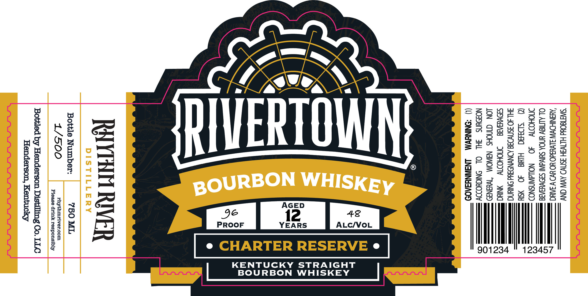
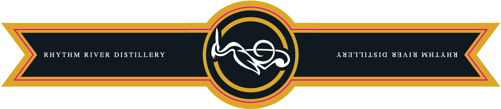

# TTB COLA Label Images - TTBID 26228001000052

**Brand Name:** RIVERTOWN

**Fanciful Name:** CHARTER RESERVE

**Issue Date:** 08/24/2026

**Origin Code:** 22

**Product Class/Type:** 101

**Source:** [TTB Public COLA Registry](https://ttbonline.gov/colasonline/viewColaDetails.do?action=publicFormDisplay&ttbid=26228001000052)

## Label Images

### Label 1

### Label 2

## Extracted Label Text

*Text extracted via OCR - may contain errors*

### Label 1

"SWIT8ONd HLTWIH ISNWD AVW CNV
‘AUINIHDWW SLWu3d0 YO HV) W IAC
OL ALTISY UNOA SuIVdWNI SIDWYIATA
DMOHODWW 40 —_NOLLdWASNOD
@) ‘SbDaad Hd 40 SY
JHL 0 3SNWI38 ADNYNDSud SN
SdOVUINIE = ITIOHODTY = NIU
LON CINOHS NAWOM ‘TWY3NaD
NOUNS HL OL OSNICYODDY
() “DNINHWM — LINAIWNYSA09

e
>
[a 4
fl
Vv)
Hill
fa
[a4
fut]
9
fa 4
<
25
U
e

RNIN RIVER

Bottle Number: 750 ML
L J. fosy OO rhythmriver.com

Please drink responsibly

Bottled by Henderson Distilling Co. LLC
Henderson, Kentucky

eK
[>
Ox
<u
rma
ns
>

£5
Un
>a
F5
ZO
vo

### Label 2

RHYTHM RIVER DISTILLERY

AUATTIILSIG AAWAIA WHLAHY
