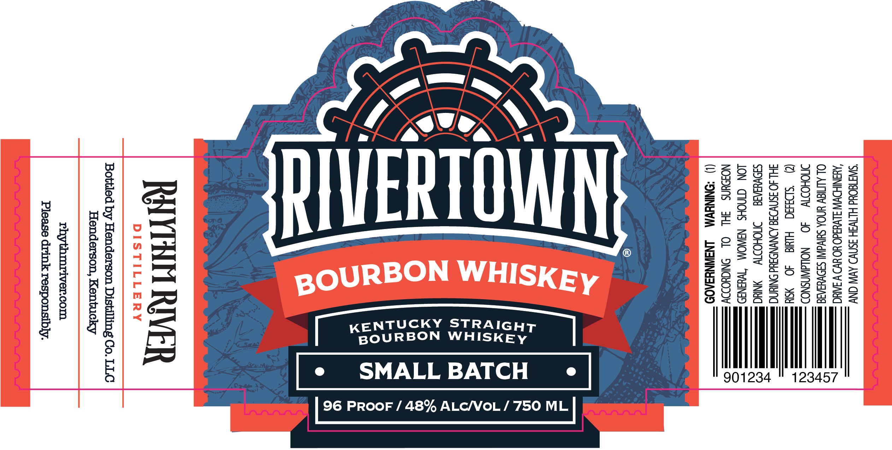

# TTB COLA Label Images - TTBID 26228001000053

**Brand Name:** RIVERTOWN

**Fanciful Name:** SMALL BATCH

**Issue Date:** 08/24/2026

**Origin Code:** 22

**Product Class/Type:** 101

**Source:** [TTB Public COLA Registry](https://ttbonline.gov/colasonline/viewColaDetails.do?action=publicFormDisplay&ttbid=26228001000053)

## Label Images

### Label 1

### Label 2

## Extracted Label Text

*Text extracted via OCR - may contain errors*

**Detected Proof:** 96

### Label 1

‘SWTEOUd HITV3H SSN AV CNY
‘END UvY3dO HO HYD W AAC
OL ALMIEW UNDA SulvdWI SAO Veg
DMOHODY §—40_—_NOILAWNSNOD
(@ ‘sba8d Hud 40 SY
FHLAO INV OND NN —
SOvaG ONOHOV Ni =
JON INOS NaWOM “TW¥aNID im
NOHUNS 3HL OL SNCYODDY ®
(1) *ONINEVM —LNAWNY3AOD

KR
lO
+
ise)
N
a

eS
OL
a2
Exo
nus
>

5
Yao
oa
z

Ww

SMALL BATCH

K
BOU

RAYINH RIVER

Bottled by Henderson Distilling Co. LLC
Henderson, Kentucky

rhythmriver.com
Please drink responsibly.

ALC/VoL / 750 ML

96 PROOF / 48%

### Label 2

RHYTHM RIVER
DIS TILLERY
XATTILSIC
JJAIU WHLAHJ
