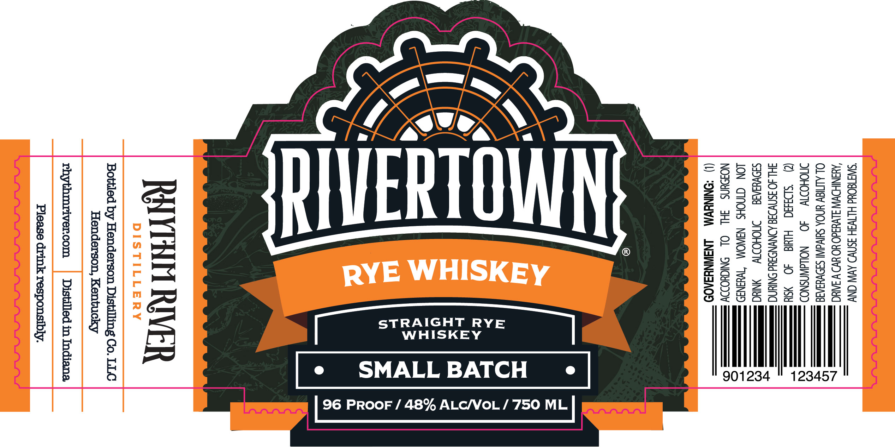
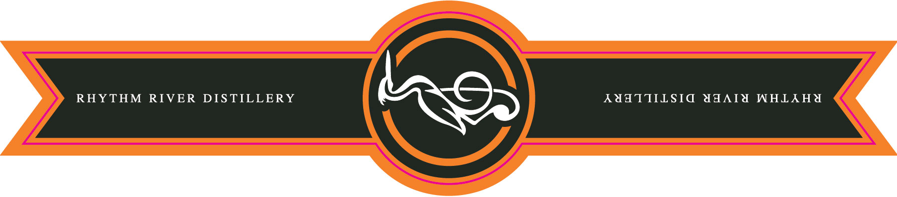

# TTB COLA Label Images - TTBID 26228001000056

**Brand Name:** RIVERTOWN

**Fanciful Name:** SMALL BATCH

**Issue Date:** 08/24/2026

**Origin Code:** 22

**Product Class/Type:** 102

**Source:** [TTB Public COLA Registry](https://ttbonline.gov/colasonline/viewColaDetails.do?action=publicFormDisplay&ttbid=26228001000056)

## Label Images

### Label 1

### Label 2

## Extracted Label Text

*Text extracted via OCR - may contain errors*

**Detected Proof:** 96

### Label 1

"SISTEOUd HITWSH SSN AV ONY
‘AUINIHDWW JLWusdO HO BVO YW 3AIUC
OL ALMIGY YNOA SUVA SIDWYSAA
MOHODY ~=40 ~—_NOLWNSNOD
() ‘SDaHd Hide 40 SY
POE OFPO\ NOs P hh; __
srw NOVY he —
LON CINOHS N3WOM “TWHaNa9
NOUNS HL OL SNIGYODDY
(1) “ONINYVM —LNSIWNYSA0D

vt
ice]
N
=
S
fo)

ALC/VoL / 750 ML

STRAIGHT RYE
WHISKEY

=
-
<
a
=
=
<
=
7

96 PROOF / 48%

RAYTHH RIVER

Bottled by Henderson Distilling Co. LLC
Henderson, Kentucky

rhythmriver.com | Distilled in Indiana
Please drink responsibly.

### Label 2

RHYTHM RIVER DISTILLERY

AUMATTIILSIC APAIY WHLAHA
