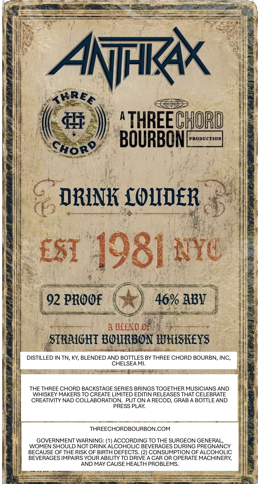
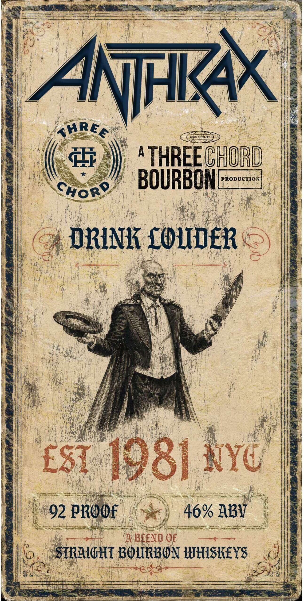

# TTB COLA Label Images - TTBID 26228001000067

**Brand Name:** THREE CHORD

**Issue Date:** 08/25/2026

**Origin Code:** 06

**Product Class/Type:** 121

**Source:** [TTB Public COLA Registry](https://ttbonline.gov/colasonline/viewColaDetails.do?action=publicFormDisplay&ttbid=26228001000067)

## Label Images

### Back Label

### Front Label

## Extracted Label Text

*Text extracted via OCR - may contain errors*

*1 image(s) excluded: text did not meet readability threshold*

**Detected Proof:** 92

### Back Label

ANFRX
Krrea
HFDELIT
T
A
THREECHORD
BOURBONL
PRODUCTION
Choro
DRINK XOLIDER
ES1 1981 NYc
92 PROOf
46% ABV
4 BLEND O1
STRALGHT ROURBON WUHISRZEYS
DISTILLED IN TN, KY, BLENDED AND BOTTLES BY THREE CHORD BOURBN, INC,
CHELSEA MI:
THE THREE CHORD BACKSTAGE SERIES BRINGS TOGETHER MUSICIANS AND
WHISKEY MAKERS TO CREATE LIMITED EDITIN RELEASES THAT CELEBRATE
CREATIVITY NAD COLLABORATION. PUT ON A RECOD, GRAB A BOTTLE AND
PRESS PLAY:
THREECHORDBOURBON.COM
GOVERNMENT WARNING: (1) ACCORDING TO THE SURGEON GENERAL,
WOMEN SHOULD NOT DRINKALCOHOLIC BEVERAGES DURING PREGNANCY
BECAUSE OF THE RISK OF BIRTH DEFECTS. (2) CONSUMPTION OF ALCOHOLIC
BEVERAGES IMPAIRS YOUR ABILITY TO DRIVE A CAR OR OPERATE MACHINERY;
AND MAY CAUSE HEALTH PROBLEMS:
