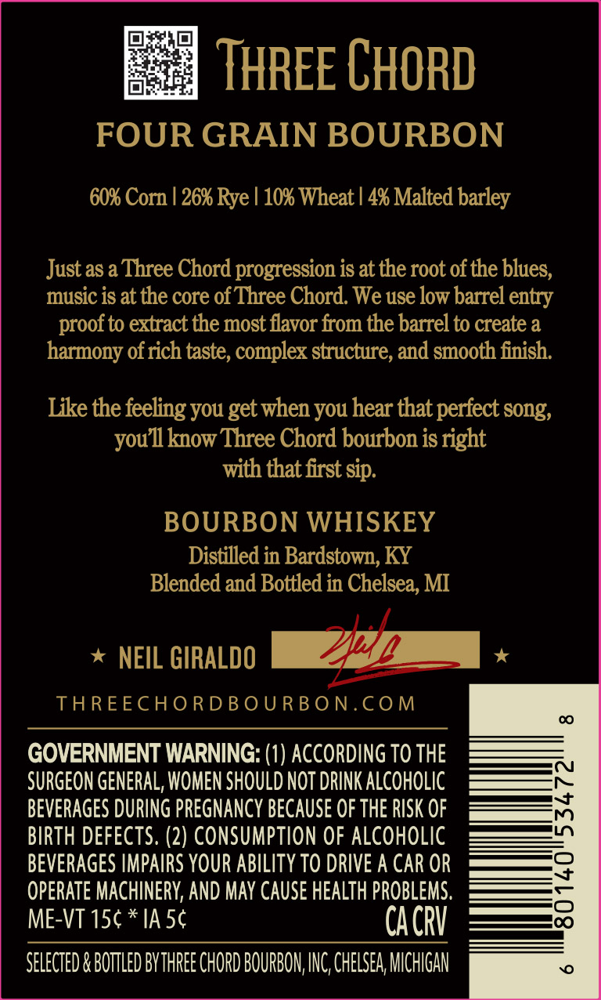
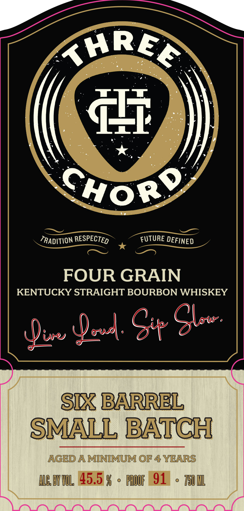

# TTB COLA Label Images - TTBID 26228001000069

**Brand Name:** THREE CHORD

**Issue Date:** 08/25/2026

**Origin Code:** 06

**Product Class/Type:** 101

**Source:** [TTB Public COLA Registry](https://ttbonline.gov/colasonline/viewColaDetails.do?action=publicFormDisplay&ttbid=26228001000069)

## Label Images

### Back Label

### Front Label

## Extracted Label Text

*Text extracted via OCR - may contain errors*

**Detected Age:** 4 Years

### Back Label

THREE CHORD
FOUR GRAIN BOURBON
60% Corn | 26% Rye / 10% Wheat | 4% Malted barley
Just asa Three Chord progression is at the root of the blues,
music is at the core of Three Chord. We use low barrel entry
proof to extract the most flavor from the barrel to create a
harmony ofrich taste, complex structure; and smooth finish:
Like the feeling you get when you hear that perfect song;
know Three Chord bourbon is right
with that first Sip.
BOURBON WHISKEY
Distilled in Bardstown, KY
Blended and Bottled in Chelsea; MI
NEIL GIRALDO
THREECHORDBOU RBON.COM
00
GOVERNMENT WARNING: (1) ACCORDING TO THE
SURGEON GENERAL; WOMEN SHOULD NOT DRINK ALCOhOLIC
BEVERAGES DURING PREGNANCY becauSe Of thE RISK OF
:
BIRTH DEFECTS. (2) CONSUMPTION OF ALCOHOLIC
BEVERAGES IMPAIRS YOUR ABILITY TO DRIVE A CAR OR
?
OPERATE MACHINERY; AND MAY CAUSE HEALTH PROBLEMS.
ME-VT 15c * IA 56
CACRV
8
SELECTEd & BOTTLED BYTHREE CHORD BOURBON, INC,CHELSEA MCHIGAN
you l1

### Front Label

KHREA
Ti
CHor9
TRADITION RESPECTED
FUTURE DEFINED
FOUR GRAIN
KENTUCKY STRAIGHT BOURBON WHISKEY
00x S+ &le:
SLX BARREL
SMALL BATCH
AGED A MINIMUM OF 4 YEARS
ILG BTCL45.5 %
FBOOF | 91
T501L
