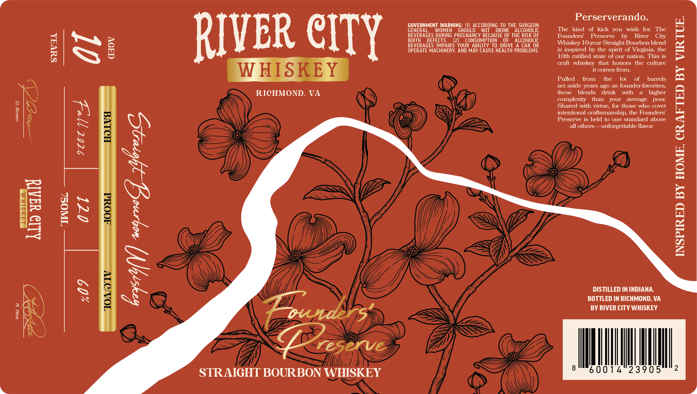

# TTB COLA Label Images - TTBID 26229001000118

**Brand Name:** RIVER CITY WHISKEY

**Issue Date:** 08/31/2026

**Origin Code:** 05

**Product Class/Type:** 101

**Source:** [TTB Public COLA Registry](https://ttbonline.gov/colasonline/viewColaDetails.do?action=publicFormDisplay&ttbid=26229001000118)

## Label Images

### Label 1

### Label 2

## Extracted Label Text

*Text extracted via OCR - may contain errors*

*1 image(s) excluded: text did not meet readability threshold*

### Label 1

NE

Alia waAld

SUVA

TIINOSL

daov

GOVERNMENT WARNING: (1) ACCORDING TO THE SURGEON
GENERAL, WOMEN SHOULD NOT DRINK ALCOHOLIC
BEVERAGES DURING PREGNANCY BECAUSE OF THE RISK OF
BIRTH DEFECTS. (2) CONSUMPTION OF ALCOHOLIC
BEVERAGES IMPAIRS YOUR ABILITY TO DRIVE A CAR OR
OPERATE MACHINERY, AND MAY CAUSE HEALTH PROBLEMS.
WHISK
. (ey

RICHMOND, VA S \ap
| >) SE

MAY) pe Wa

«)
M

U)

STRAIGHT BOURBON

WHISKEY

~— wm

oo, oe

Perserverando.

The kind of kick you wish for The

Founders’ Preserve by River City

Whiskey 10-year Straight Bourbon blend

is inspired by the spirit of Virginia, the

10th ratified state of our nation. This is

craft whiskey that honors the culture
it comes from.

Pulled from the lot of barrels
set aside years ago as founder-favorites,
these blends drink with a higher
complexity than your average pour.
Shared with virtue, for those who covet
intentional craftsmanship, the Founders’
Preserve is held to one standard above
all others —unforgettable flavor.

DISTILLED IN INDIANA.
BOTTLED IN RICHMOND, VA
BY RIVER CITY WHISKEY

INSPIRED BY HOME, CRAFTED BY VIRTUE.
