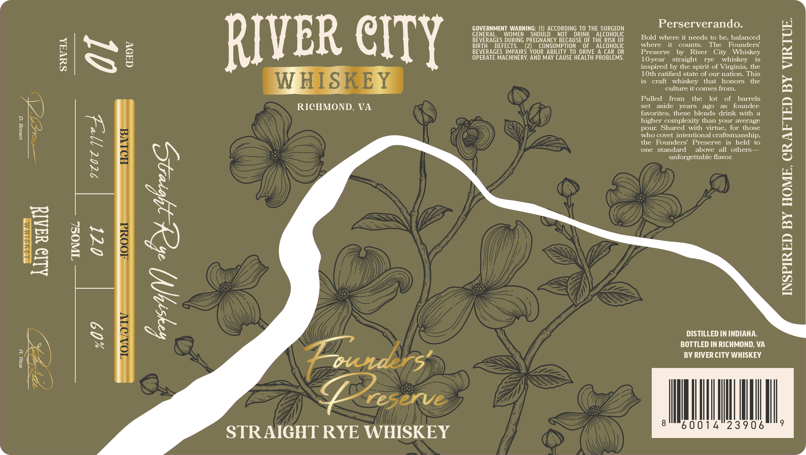

# TTB COLA Label Images - TTBID 26229001000122

**Brand Name:** RIVER CITY WHISKEY

**Issue Date:** 09/01/2026

**Origin Code:** 05

**Product Class/Type:** 102

**Source:** [TTB Public COLA Registry](https://ttbonline.gov/colasonline/viewColaDetails.do?action=publicFormDisplay&ttbid=26229001000122)

## Label Images

### Label 1

### Label 2

## Extracted Label Text

*Text extracted via OCR - may contain errors*

*1 image(s) excluded: text did not meet readability threshold*

### Label 1

10-year straight rye whiskey is
inspired by the spirit of Virginia, the

10th ratified state of our nation. This
S is craft whiskey that honors the
culture it comes from.

Pulled from the lot of barrels
RICHMOND, VA set aside years ago as founder-
favorites, these blends drink with a
higher complexity than your average
pour. Shared with virtue, for those
who covet intentional craftsmanship,
the Founders’ Preserve is held to
one standard above all others—
unforgettable flavor.

Sepa hea mtg! eee nees
BEVERAGES DURING PREGNANCY BECAUSE OF THE RISK OF | Bold where it needs to be, balanced
BIRTH DEFECTS. (2) CONSUMPTION OF ALCOHOLIC where it counts. The Founders
BEVERAGES IMPAIRS YOUR ABILITY TO DRIVE A CAR OR Preserve by River City Whiskey
OPERATE MACHINERY, AND MAY CAUSE HEALTH PROBLEMS.

SUVA

umolg ‘Gq

AIMS LEM
hua wily
INSPIRED BY HOME, CRAFTED BY VIRTUE.

DISTILLED IN INDIANA.

BOTTLED IN RICHMOND, VA
punders’ BY RIVER CITY WHISKEY
Mh MI

821 “Y

STRAIGHT RYE WHISKEY
