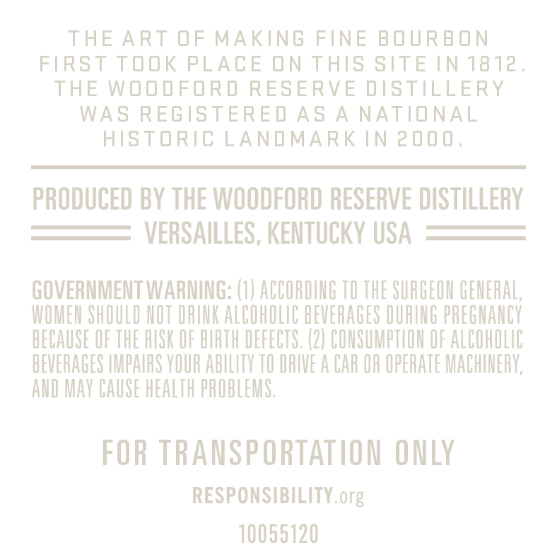
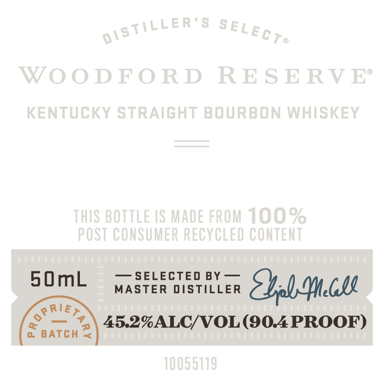

# TTB COLA Label Images - TTBID 26229001000127

**Brand Name:** WOODFORD RESERVE

**Issue Date:** 08/24/2026

**Origin Code:** 22

**Product Class/Type:** 101

**Source:** [TTB Public COLA Registry](https://ttbonline.gov/colasonline/viewColaDetails.do?action=publicFormDisplay&ttbid=26229001000127)

## Label Images

### Back Label

### Front Label

## Extracted Label Text

*Text extracted via OCR - may contain errors*

**Detected Proof:** 90.4

### Back Label

THE ART OF MAKING FINE BOURBON

FIRST TOOK PLACE ON THIS SITE IN 1812.

THE WOODFORD RESERVE DISTILLERY

WAS REGISTERED AS A NATIONAL

HISTORIC LANDMARK IN 2000.

PRODUCED BY THE WOODFORD RESERVE DISTILLERY

VERSAILLES, KENTUCKY USA

GOVERNMENT WARNING: (1) ACCORDING TO THE SURGEON GENERAL,

WOMEN SHOULD NOT DRINK ALCOHOLIC BEVERAGES DURING PREGNANCY

BECAUSE OF THE RISK OF BIRTH DEFECTS. (2) CONSUMPTION OF ALCOHOLIC

BEVERAGES IMPAIRS YOUR ABILITY TO DRIVE A CAR OR OPERATE MACHINERY

AND MAY CAUSE HEALTH PROBLEMS.

FOR TRANSPORTATION ONLY

RESPONSIBILITY. org

10055120

### Front Label

WooDFOR D
RE S E RV Ee
KenTUCKY StrAiGHT BouRbon WHISKEY
THIS BOTTLE /S MADe FROM 100%
POST CONSUMER RECYCLED CONTENT
5OmL
SELECTED
BY
MASTER DISTILLER
Zlaa.al
RIE
45.2%ALC/VOL (904 PROOF)
BATCH
10055119
0ISTiller'8
SELECTe
